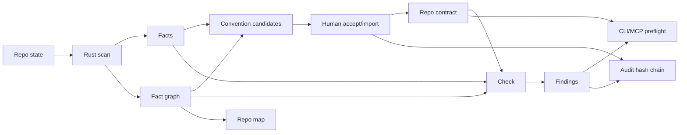

# Drift V3 Canonical Contracts

Date: 2026-05-22

This document defines the canonical Drift contract surfaces against the current repo state. It is not a product manifesto. A contract here means a versioned or otherwise testable boundary with fields, invariants, failure behavior, and proof obligations.

The short version:

- The product direction is coherent: local-first repo facts become human-accepted conventions, then `check` blocks drift with evidence.
- The type/schema/storage spine is real.
- The beta proof still depends on a clean, reproducible accepted-contract loop and a passing full gate.
- Several GPT Pro-suggested fields are good requirements but are not implemented today. They are marked as gaps, not described as current behavior.

## Verification Boundary

Commands run or used as current evidence:

```bash
git -C "drift v3" status --short --branch
node packages/cli/dist/main.js capabilities --json
node packages/cli/dist/main.js --db output/dogfood/drift-state/repo_8e87fba3c58ea49b/drift.sqlite scan status --repo repo_8e87fba3c58ea49b --json
sqlite3 output/dogfood/drift-state/repo_8e87fba3c58ea49b/drift.sqlite "select 'migrations', count(*) from schema_migrations union all select 'facts', count(*) from facts union all select 'graph_nodes', count(*) from graph_nodes union all select 'graph_edges', count(*) from graph_edges union all select 'graph_evidence', count(*) from graph_evidence union all select 'convention_candidates', count(*) from convention_candidates union all select 'repo_contracts', count(*) from repo_contracts union all select 'audit_events', count(*) from audit_events;"
node packages/cli/dist/main.js --db output/dogfood/drift-state/repo_8e87fba3c58ea49b/drift.sqlite check --repo repo_8e87fba3c58ea49b --scope full --json
```

Known gate result from the current assessment packet:

- `pnpm verify:ci` exists in `package.json:21`.
- The latest audit run did not pass end to end; it failed during `pnpm test` in `packages/cli/test/cli.test.ts`.
- This doc pass did not rerun full CI. It only verifies source and fast live state needed to classify contracts.

Current live dogfood state:

- Branch: `codex/drift-sprints-15-25`.
- Worktree: dirty, with many modified files and untracked docs/fixtures.
- Dogfood scan: completed but stale; `scan status` reports `resolver_inputs_changed` and 18 modified files.
- Dogfood DB counts from the built CLI artifact: 9 migrations, 15907 facts, 16128 graph nodes, 23337 graph edges, 11488 graph evidence rows, 0 convention candidates, 0 repo contracts, 4 audit events.
- Source currently defines 10 migrations in `packages/storage/src/migrations.ts:6`, with `010_audit_sequence` at `packages/storage/src/migrations.ts:437`; source tests expect `supported_sqlite_schema_version: 10`. The built dogfood artifact reporting schema 9 is release-hygiene evidence that generated/runtime artifacts can drift from source unless rebuilt and gated.
- Dogfood `check --scope full`: fails closed with `No repo contract exists for repo_8e87fba3c58ea49b.`

## Status Labels

- `canonical-beta`: must be true for a credible beta proof.
- `canonical-defined`: implemented or defined enough to keep as a durable contract, but not the narrow beta blocker.
- `partial`: real code exists, but the contract is missing important fields, enforcement, parity, or release proof.
- `experimental`: useful work in progress, allowed to change.
- `deferred`: explicitly outside beta scope.
- `speculative`: proposed field or behavior not supported by current repo evidence.

## Cross-Cutting Rules

1. Do not claim a contract exists unless it has source evidence: type/schema, storage, command, test, or generated output.
2. Only accepted deterministic conventions may block.
3. Candidate inference may propose governance; it must not create governance by itself.
4. No blocking finding should ship without contract id, file/range, evidence, and an understandable fix direction.
5. Fallback scanner output cannot be production-equivalent.
6. Incremental scan reporting is not incremental reuse.
7. MCP is a read-only transport. Product logic should live in shared query/domain code.
8. A beta demo from dirty state is not beta-grade.
9. Scanner skip rules, context egress denied globs, and support/export redaction are separate controls. Rust skip behavior is the production scanner guarantee; policy denied globs are output controls; TypeScript fallback is degraded and cannot be claimed equivalent for secret-like handling.
10. The SQLite DB, backups, audit output, repo map metadata, and support/debug artifacts are sensitive local repo metadata even when they do not contain source text.
11. CLI `--json` and MCP results need versioned response schemas; snapshot parity is proof, not the boundary.
12. Every production refusal or failure needs a stable code, surface, severity, retry guidance, user action, and recovery command.
13. Public beta/release claims require a generated proof artifact, not a hand-written checklist.

## Canonical Flow



Current mismatch:

- The source has the pieces for this loop.
- The live dogfood DB does not currently contain candidates or a repo contract.
- The working tree is dirty.
- Full CI is not currently proven green.

## Contract Index

| Contract | Status | Current evidence | Main gap |
| --- | --- | --- | --- |
| Product/Capability | canonical-beta | `packages/core/src/capabilities.ts`, `packages/cli/src/domain/versions.ts`, CLI `capabilities --json` | Needs release gate that prevents broad claims beyond the narrow wedge. |
| Repo Identity | partial | `RepoRecord`, `ScanManifest`, `repoIdForRoot`, `repoRecordForRoot` | No persisted remote hash, VCS provider, package manager, lockfile hash, or full clean-commit gate. |
| Scan/Freshness | canonical-beta | `ScanManifest`, `ScanFileChange`, `scanStatusPayload`, resolver-input fingerprint | Incremental reuse is not implemented; freshness is not uniformly enforced by `check`. |
| Engine Boundary | canonical-beta | `@drift/engine-contract` schemas, Rust bridge, stream parsing tests | Fallback metadata is weak; fallback can emit empty graph/diagnostics when explicitly enabled. |
| Fact | canonical-defined | `FactRecord`, `FactKind`, `facts` table | Facts lack confidence, extractor id, resolved target, and provenance beyond file/range/fact ids. |
| Graph | canonical-beta | `@drift/factgraph`, graph migrations/projections, query package | Graph coverage must stay capability-gated; not every check output persists graph path. |
| Candidate Convention | canonical-beta | `ConventionCandidate`, inference, accept flow | Dogfood currently has zero candidates; candidate inference is not enough for beta. |
| Accepted Convention | canonical-beta | `AcceptedConvention`, `accepted_conventions`, `--confirm` accept/import | No explicit `source` field and no proposed/disabled status vocabulary. |
| Repo Contract | canonical-beta | `RepoContract`, `repo_contracts`, canonical contract JSON/fingerprint | No separate `policy_mode`; fingerprint is computed, not stored as a first-class column. |
| Finding | partial | `Finding`, `findings`, engine finding schema | Missing persisted `check_id`, `repo_contract_id`, expected/actual layer, graph path, suggested fix. |
| Check | partial | `runCheck`, engine check request/result schemas, check parity tests | No persisted check object/table; current `check` collects scan data ad hoc and does not enforce scan-status freshness. |
| Agent Envelope | canonical-defined | `AgentEnvelopeV2`, CLI/MCP envelope helpers | Envelope is intentionally minimal; it is not the full repo/context packet. |
| MCP | partial | 10 read-only MCP tools, argument validation, tests | MCP still duplicates scan/preflight/repo-map assembly and can drift from CLI. |
| Storage/Migrations | canonical-beta | migrations 001-010 in source, SQLite storage tests | No `checks` table; release gate does not yet prove source/dist migration parity or migration/backup/check loop from clean commit. |
| Governance/Audit | canonical-beta | mutation governance, `--confirm`, audit hash chain | Audit events do not carry explicit before/after object hashes. |
| Backup/Restore | canonical-defined | backup manifests, create/verify/restore commands/tests | Beta only needs this if included in the demo/release claim. |
| Release/Beta | partial | `verify:ci` script, e2e fixture tests, current audit doc | Full gate failing/partial, dirty worktree, dogfood contract missing. |
| Agent-Facing Response Schema | partial | CLI `CommandPayload`, MCP handlers/tools | CLI payloads and MCP tool returns are mostly `unknown`; no shared versioned output schema contract. |
| Transport Boundary | partial | CLI router, MCP JSON-RPC handlers | MCP still performs repo/domain work inline instead of only validating args and calling shared read models. |
| Release Proof Artifact | speculative | Release workflows and installed-flow tests provide ingredients | No generated proof artifact binds commit, packages, engine binaries, dogfood scan/contract/check, MCP parity, and audit head. |
| CI/Gate | partial | `pnpm verify:ci`, CI workflow, engine release workflow | PR gate, release gate, installed smoke, matrix validation, and artifact freshness are not all captured as one contract. |
| Packaged Engine/Installer | canonical-defined | engine resolver, optional packages, checksum validation | Engine provenance is not exposed through `doctor --json` and `version --json`. |
| Update/Compatibility | canonical-defined | release compatibility policy, schema versions, migration checks | Compatibility policy is split across docs and not summarized in canonical contracts. |
| Operational Failure Modes | partial | CLI refusals, engine resolver errors, beta refusal list | No stable cross-surface error code taxonomy. |
| Local State Sensitivity | canonical-defined | SQLite paths/facts/graph/audit/backup schema, security docs | Sensitivity rules are not first-class in storage/backup/audit contracts. |
| Support/Debuggability | speculative | `doctor --json`, backup verify, audit verify | No support bundle exists; future support bundle boundaries must be defined before implementation. |
| Production Scope/Claims | partial | capabilities output, doctor V1 scope | No release gate prevents docs/marketing from exceeding implemented capabilities. |

## Contract Definitions

### 1. Product/Capability Contract

Purpose: define what Drift is allowed to claim.

Current implementation:

- `DriftCapabilities` defines CLI, MCP, supported wedge, and deferred surfaces in `packages/core/src/capabilities.ts:1`.
- Default MCP read-only tools are listed in `packages/core/src/capabilities.ts:17`.
- Supported wedge is TypeScript/JavaScript, deterministic `api_route_no_direct_data_access`, heuristic `api_route_requires_service_delegation`, SQLite storage, and no source mutation in `packages/core/src/capabilities.ts:84`.
- CLI version/capability payload is built in `packages/cli/src/domain/versions.ts:41`.
- `doctorV1Scope` reports `local_first_cli`, `typescript_api_route_layering`, human-confirmed governance, no source mutation, and deferred desktop/cloud/Python/duplicate-helper work in `packages/cli/src/domain/versions.ts:70`.
- Live `capabilities --json` matched that scope.

Required invariants:

- Beta claim is local-first TypeScript API route layering, not general repo governance.
- Only deterministic `api_route_no_direct_data_access` can block in beta.
- Service delegation remains heuristic until capability-gated as deterministic.
- Deferred capabilities must not show up as beta promises.

Gaps:

- No explicit product contract file or generated release artifact binds marketing/docs to capabilities output.
- No release script currently fails if docs claim unsupported capabilities.

Beta status: `canonical-beta`.

### 2. Repo Identity Contract

Purpose: bind scans, contracts, and findings to a repo and state.

Current implementation:

- `RepoRecord` has `id`, `root_path`, `fingerprint`, `created_at`, `updated_at` in `packages/core/src/domain.ts:92`.
- `ScanManifest` carries `repo_id`, `branch`, `commit`, and `dirty` in `packages/core/src/domain.ts:100`.
- `repoIdForRoot` hashes the resolved repo root in `packages/cli/src/domain/identifiers.ts:5`.
- `repoRecordForRoot` uses root path as repo fingerprint in `packages/cli/src/domain/repo-paths.ts:118`.
- Scan captures branch, commit, dirty state, scanner versions, resolver version, and resolver input fingerprint in `packages/cli/src/domain/scan-status.ts:96`.

Required invariants:

- No beta demo from dirty/uncommitted state.
- Scan output must expose branch, commit, and dirty state.
- Contract import must reject repo id or fingerprint mismatch.

Gaps and speculative fields:

- GPT Pro suggested `vcs_provider`, `remote_url_hash`, `package_manager`, `lockfile_hashes`, and `tsconfig_hash`. Current code does not persist those in `RepoRecord` or `ScanManifest`.
- `detectPackageManager` exists in `packages/cli/src/domain/repo-paths.ts:70`, but it is not the repo identity contract.
- Resolver input fingerprint covers `package.json`, `jsconfig.json`, and `tsconfig*.json` files via `resolverInputPaths` in `packages/cli/src/domain/scan-status.ts:624`, not lockfiles.
- Clean-worktree gating is a beta/release requirement, not a persisted contract invariant today.

Beta status: `partial`.

### 3. Scan And Freshness Contract

Purpose: define how Drift turns repo state into stored scan output and stale/fresh status.

Current implementation:

- `ScanManifest`, `FileSnapshot`, `ScanFileChange`, and `ResolverDependency` are typed in `packages/core/src/domain.ts:100`, `packages/core/src/domain.ts:119`, `packages/core/src/domain.ts:130`, and `packages/core/src/domain.ts:140`.
- `scan_manifests`, `file_snapshots`, `scan_file_changes`, and resolver/module projection tables are created in `packages/storage/src/migrations.ts:23`, `packages/storage/src/migrations.ts:46`, `packages/storage/src/migrations.ts:369`, and `packages/storage/src/migrations.ts:411`.
- `runScanRepo` stores manifest, snapshots, file changes, facts, graph artifact, candidates, and scan audit events in `packages/cli/src/domain/scan-status.ts:40`.
- `incrementalScanPlan` is explicit: `execution_mode: "full_scan"`, `reuse_applied: false`, and always includes `engine_reuse_not_enabled` in `packages/cli/src/domain/scan-status.ts:31` and `packages/cli/src/domain/scan-status.ts:341`.
- `scanStatusPayload` detects source changes, branch drift, version drift, resolver input drift, and audit validity in `packages/cli/src/domain/scan-status.ts:372`.
- Resolver input drift is tested in `packages/cli/test/cli.test.ts:1435`.

Required invariants:

- Full scan must say full scan.
- Reuse must not be claimed unless reuse is real.
- Stale scan status must be visible to CLI/MCP/preflight.
- A beta release script should require fresh scan before demo.
- Freshness is one shared read model with one invalidation enum. CLI, MCP, prepare, repo map, findings, allowed context, and check should expose the same `stale`, `invalidation_reasons`, and `freshness_requirement`.
- If `check` uses check-time collection instead of stored scan state, the output must say that explicitly and still report engine/fallback/freshness status.

Gaps:

- Incremental scan state is status/explanation only; no invalidation-safe reuse path exists.
- `runCheck` does not call `scanStatusPayload` or require a fresh stored scan. It collects current scan data with a `scan_check_...` id in `packages/cli/src/check/run-check.ts:53`.
- MCP scan status duplicates CLI logic and currently omits resolver-input fingerprint invalidation; compare CLI `scanInvalidationReasons` in `packages/cli/src/domain/scan-status.ts:594` with MCP duplicate in `packages/mcp/src/index.ts:1399`.

Beta status: `canonical-beta`, with release enforcement still missing.

### 4. Engine Boundary Contract

Purpose: keep Rust engine results schema-checked at the TypeScript boundary.

Current implementation:

- Engine schema versions are declared in `packages/engine-contract/src/index.ts:8`.
- Scan request/result schemas cover limits, repo context, file snapshots, facts, diagnostics, stats, completeness, and optional graph in `packages/engine-contract/src/index.ts:19` and `packages/engine-contract/src/index.ts:124`.
- Check request/result schemas carry repo, graph, scan, contract, baseline, diff, limits, findings, diagnostics, stats, and completeness in `packages/engine-contract/src/index.ts:163` and `packages/engine-contract/src/index.ts:277`.
- Blocking check results require complete capability coverage in `packages/engine-contract/src/index.ts:290`.
- Stream events include file snapshot, fact, graph node, graph edge, graph evidence, diagnostic, stats, and completion events in `packages/engine-contract/src/index.ts:327`.
- Boundary tests validate scan, stream, graph stream, check, and missing-capability rejection in `packages/engine-contract/test/engine-contract.test.ts:13`.

Packaged engine resolution:

- The resolver supports `env_override`, `workspace_cargo`, and `packaged_optional_dependency` sources in `packages/cli/src/engine/rust-engine.ts:10`.
- The packaged path is resolved from the optional engine package manifest in `packages/cli/src/engine/rust-engine.ts:154`.
- Packaged binaries are checked for platform/arch match, package-owned path, executable bit, and SHA-256 match before spawn in `packages/cli/src/engine/rust-engine.ts:167`.
- `DRIFT_ENGINE_BIN` is allowed as an explicit override and is hashed in `packages/cli/src/engine/rust-engine.ts:195`.

Fallback behavior:

- Rust is attempted first in `packages/cli/src/engine/collect-scan-data.ts:28`.
- TypeScript fallback only runs if `DRIFT_ALLOW_TYPESCRIPT_ENGINE_FALLBACK=1` in `packages/cli/src/engine/collect-scan-data.ts:31`.
- Fallback returns `engineSource: "typescript"` with empty diagnostics, graph nodes, graph edges, and graph evidence in `packages/cli/src/engine/collect-scan-data.ts:37`.
- Tests verify no silent fallback when Rust is unavailable in `packages/cli/test/engine-bridge.test.ts:17`.

Required invariants:

- Beta uses Rust engine path only.
- Fallback must be visibly degraded or blocked in beta release scripts.
- Blocking findings require complete capability coverage.
- Installed production mode should use a package-owned binary path unless `DRIFT_ENGINE_BIN` is explicitly set by the user.
- Packaged binary checksum mismatch, platform mismatch, non-executable binary, or package path escape must fail closed.
- JSON surfaces should expose `fallback_status`: `engine_source`, `fallback_used`, `fallback_reason`, `degraded_capabilities`, and `enforcement_degraded`.
- Before packaged Rust support is claimed, `doctor --json` and `version --json` should include engine provenance: `engine.source`, `engine.path`, `engine.package_name`, `engine.package_version`, `engine.sha256`, `engine.expected_sha256`, `engine.checksum_matches`, `engine.override_active`, and `engine.status`.

Gaps:

- No persisted `fallback_used` field exists in `ScanManifest`.
- Fallback diagnostics are empty, so fallback can look successful unless callers inspect `engine_source`.
- Beta check does not explicitly reject `engine_source: "typescript"`.
- Version and doctor payloads currently expose CLI/core/schema health, not a complete engine provenance object.

Beta status: `canonical-beta`, with fallback hardening required.

### 5. Fact Contract

Purpose: define atomic extracted facts before graph/query/check surfaces use them.

Current implementation:

- `FactKind` includes file, import, re-export, exported symbol, symbol call, data operation, route, file role, and test facts in `packages/core/src/domain.ts:181`.
- `FactRecord` stores id, repo id, scan id, kind, file path, name/value, and line range in `packages/core/src/domain.ts:192`.
- `FactRecordSchema` validates the same shape in `packages/core/src/schemas.ts:205`.
- SQLite `facts` table exists in migration `002_scan_facts` in `packages/storage/src/migrations.ts:114`.
- Storage writes/reads facts through `upsertFacts` and `listFacts` in `packages/storage/src/sqlite-storage.ts:312`.

Required invariants:

- Every fact binds to repo id and scan id.
- Every fact has a file path and line range.
- Facts are queryable independently of agent prompts.

Gaps:

- No `extractor`, `confidence`, `resolved_target`, or uncertainty field exists.
- Resolved import evidence is represented in graph nodes/edges, not in `FactRecord`.

Beta status: `canonical-defined`.

### 6. Graph Contract

Purpose: represent repo structure as nodes, edges, evidence, diagnostics, and completeness.

Current implementation:

- Fact graph schema version is `factgraph.v2` in `packages/factgraph/src/index.ts:6`.
- Node kinds include repo/package/artifact/file/module/symbol/import/call/data/endpoint/route/file_role/diagnostic/finding in `packages/factgraph/src/index.ts:9`.
- Edge kinds include file/module/import/export/call/data/finding evidence relationships in `packages/factgraph/src/index.ts:30`.
- Graph evidence stores repo id, scan id, artifact id, file path/hash, range, adapter id/version, fact ids, and redaction state in `packages/factgraph/src/index.ts:54`.
- Fact graph artifact stores repo, adapters, artifacts, nodes, edges, evidence, diagnostics, completeness, and stats in `packages/factgraph/src/index.ts:116`.
- SQLite graph projections are created in migrations `006_fact_graph_artifacts` and `007_fact_graph_v2_projections` in `packages/storage/src/migrations.ts:244` and `packages/storage/src/migrations.ts:292`.
- Storage persists graph artifacts and projections in `packages/storage/src/sqlite-storage.ts:350`.
- Query repo map reads graph nodes/edges/evidence via `@drift/query` in `packages/query/src/index.ts:183`.
- Fixture matrix tests cover graph-resolved service flow, aliases, barrel re-exports, namespace imports, dynamic routes, write data operations, and mixed JS/TS in `test/e2e/fixture-matrix.test.ts:34`.

Required invariants:

- Graph output binds to repo id and scan id.
- Blocking graph-backed checks must carry evidence or capability completeness.
- Repo map surfaces must not include source snippets.
- `redaction_state: "none"` means evidence location/hash metadata was not reduced; it does not imply source text is present. Source text may only appear in an explicit snippet/source field with policy proof and size caps.

Gaps:

- Current persisted `Finding` does not preserve `related_node_ids` from engine findings.
- Check output does not persist a graph path or expected/actual layer.
- The fixture matrix files are currently untracked in the dirty working tree, so they are not beta release proof until committed and CI passes.

Beta status: `canonical-beta`.

### 7. Candidate Convention Contract

Purpose: represent inferred conventions before human approval.

Current implementation:

- `ConventionCandidate` includes id, repo id, scan id, kind, statement, rationale, scope, matcher, suggested severity/mode, enforcement capability, confidence, scoring, evidence refs, counterexamples, status, and timestamp in `packages/core/src/domain.ts:282`.
- Candidate schema mirrors this in `packages/core/src/schemas.ts:298`.
- `convention_candidates` table exists in `packages/storage/src/migrations.ts:141`.
- Candidate acceptance requires `--confirm`; see `acceptConventionCandidate` in `packages/cli/src/domain/convention-candidates.ts:12`.
- Candidate inference can produce deterministic `api_route_no_direct_data_access` and heuristic `api_route_requires_service_delegation` candidates in `packages/cli/src/domain/convention-candidates.ts:259`.

Required invariants:

- Candidate state cannot block.
- Human approval is required before governance.
- Only deterministic candidates may be accepted with `--mode block`.

Gaps:

- Dogfood state currently has zero candidates.
- Status vocabulary is `candidate | accepted | rejected | archived | expired`; GPT Pro's `proposed` and `disabled` are not implemented.

Beta status: `canonical-beta`.

### 8. Accepted Convention Contract

Purpose: represent a human-approved convention that can be included in a repo contract.

Current implementation:

- `AcceptedConvention` includes contract id, kind, statement, scope, matcher, severity, enforcement mode, enforcement capability, exceptions, evidence, counterexamples, accepted by/at, updated at, and optional expiry in `packages/core/src/domain.ts:302`.
- `accepted_conventions` table exists in `packages/storage/src/migrations.ts:165`.
- Storage writes accepted conventions in `packages/storage/src/sqlite-storage.ts:751`.
- `acceptConventionCandidate` validates deterministic blocking and requires confirmation in `packages/cli/src/domain/convention-candidates.ts:42` and `packages/cli/src/domain/convention-candidates.ts:45`.

Required invariants:

- Only accepted conventions can block.
- Blocking requires deterministic capability.
- Expired conventions are not checked.

Gaps:

- No explicit `source: inferred | imported | hand_authored` field exists.
- Accepted convention immutability is not strict; upserts can update existing rows.

Beta status: `canonical-beta`.

### 9. Repo Contract Contract

Purpose: define the active enforceable contract bundle for a repo.

Current implementation:

- `RepoContract` includes id, repo id, schema version, repo fingerprint, conventions, rejected inferences, waivers, risky areas, safe commands, required checks, context egress, and agent permissions in `packages/core/src/domain.ts:412`.
- `RepoContractSchema` validates it in `packages/core/src/schemas.ts:435`.
- `repo_contracts` table stores one contract JSON per repo in `packages/storage/src/migrations.ts:190`.
- Storage upserts and reads the contract in `packages/storage/src/sqlite-storage.ts:811`.
- Canonical JSON/fingerprint helpers exist in `packages/core/src/contracts.ts:3` and `packages/cli/src/domain/identifiers.ts:13`.
- `contract show`, `validate`, `export`, `import`, and waiver commands are implemented in `packages/cli/src/commands/contract.ts:16`.

Required invariants:

- `check` must require a repo contract.
- Import must validate schema, repo id, repo fingerprint, convention contract ids, uniqueness, and checksum when requested.
- Mutating contract actions require `--confirm`.

Gaps:

- No separate `policy_mode: advisory | blocking` field exists.
- No stored `hash` column exists; fingerprint is computed at command time.
- Current dogfood DB has zero repo contracts.

Beta status: `canonical-beta`.

### 10. Finding Contract

Purpose: define evidence-backed drift output.

Current implementation:

- `Finding` stores id, repo id, convention id, fingerprint, title, message, severity, enforcement result, status, diff status, evidence refs, and created at in `packages/core/src/domain.ts:356`.
- `FindingSchema` validates this in `packages/core/src/schemas.ts:374`.
- `findings` table exists in `packages/storage/src/migrations.ts:58`.
- Storage upserts/list findings in `packages/storage/src/sqlite-storage.ts:629`.
- Engine finding schema includes rule id, status hint, evidence, and `related_node_ids` in `packages/engine-contract/src/index.ts:262`.
- CLI check maps engine findings into stored Drift findings in `packages/cli/src/check/run-check.ts:305`.
- CLI tests verify blocking findings include evidence file, line, import, symbol, scan id, and hash in `packages/cli/test/cli.test.ts:2604`.

Required invariants:

- A blocking finding must name the accepted convention.
- It must include file/range and evidence.
- It must distinguish new, pre-existing, fixed, false-positive, accepted drift, suppressed, and expired states.

Gaps:

- No persisted `check_id`.
- No persisted `repo_contract_id`.
- No `expected_layer`, `actual_layer`, `graph_path`, or `suggested_fix` fields.
- Engine `related_node_ids` are not persisted in `Finding`.
- Current message text includes a fix direction, but not a structured suggested fix.

Beta status: `partial`. This is the highest-leverage missing beta surface.

### 11. Check Contract

Purpose: evaluate current repo data against accepted repo contracts.

Current implementation:

- `runCheck` requires repo and repo contract before evaluating in `packages/cli/src/check/run-check.ts:24`.
- It denies output if policy denies `cli-check` in `packages/cli/src/check/run-check.ts:34`.
- It accepts scopes `changed-hunks`, `changed-files`, and `full` in `packages/cli/src/check/run-check.ts:39`.
- It collects current scan data through the Rust bridge in `packages/cli/src/check/run-check.ts:53`.
- Engine-owned direct-data-access check filters active deterministic `api_route_no_direct_data_access` conventions in `packages/cli/src/check/run-check.ts:211`.
- Engine check request includes scan facts, graph, contract, baseline, and diff in `packages/cli/src/engine/engine-check.ts:31`.
- Blocking count drives exit code in `packages/cli/src/check/run-check.ts:175`.
- Check parity tests exist in `packages/cli/test/check-parity.test.ts:14`.
- CLI test proves accepted deterministic convention blocks changed hunk and stores finding in `packages/cli/test/cli.test.ts:2604`.

Required invariants:

- No contract means blocked/refused, not pass.
- Blocking findings require deterministic convention and complete capability coverage.
- Good route should pass; bad route should block.
- Output must explain what failed.
- Check JSON should include `check_id`, `contract_status`, `contract_id`, `contract_fingerprint`, `scan_status`, `engine_source`, `fallback_status`, and `capability_completeness`.
- Once a checks table exists, `check_id` must be persisted and referenced by findings.

Gaps:

- No first-class persisted check table or check id.
- `runCheck` does not require the stored scan status to be fresh; it runs a check-time collection.
- Current check payload returns policy/audit/summary/review/finding data, but not a stable check identity or full contract/freshness identity.
- Current dogfood `check` fails before product proof because no repo contract exists.
- A release-grade beta script still needs clean checkout, full CI, fresh Rust scan, accepted contract, good pass, bad block, audit verify, and MCP parity.

Beta status: `partial`.

### 12. Agent Envelope Contract

Purpose: provide a small, read-only state envelope for CLI/MCP outputs.

Current implementation:

- `AgentEnvelopeV2` has schema version, action, surface, read-only flag, policy, scan stale/latest scan state, redaction state, and diagnostics in `packages/core/src/agent-envelope.ts:10`.
- CLI envelope helper is in `packages/cli/src/domain/agent-envelope.ts:4`.
- MCP duplicates a similar helper in `packages/mcp/src/index.ts:1904`.
- `prepare` includes the envelope in `packages/cli/src/commands/prepare.ts:95`.

Required invariants:

- Agent envelope is read-only.
- It reports stale/missing scan state.
- It reports redaction/source snippet state.

Gaps:

- It is not a full agent packet. It does not itself carry repo map, active contracts, or findings.
- CLI/MCP envelope helper duplication is minor but still a drift point.

Beta status: `canonical-defined`.

### 13. MCP Contract

Purpose: expose read-only repo truth to agent/tooling surfaces.

Current implementation:

- `DRIFT_READ_ONLY_MCP_TOOLS` defines 10 tools in `packages/mcp/src/tools.ts:3`.
- Tool list: `get_runtime_info`, `get_capabilities`, `get_audit_status`, `get_scan_status`, `get_repo_contract`, `get_repo_map`, `get_task_preflight`, `get_conventions`, `get_findings`, `get_allowed_context`.
- MCP handlers are created by `createReadOnlyMcpHandlers` in `packages/mcp/src/index.ts:67`.
- JSON-RPC rejects unknown non-read-only tools in `packages/mcp/src/index.ts:380`.
- Argument validation rejects missing, extra, blank, unsafe, and wrong-typed args in `packages/mcp/src/index.ts:647`.
- Tests verify tool list and read-only tool names in `packages/mcp/test/mcp.test.ts:1989`.

Required invariants:

- No MCP mutation tools in beta.
- MCP truth should match CLI truth.
- MCP should stay transport/validation over shared query builders.
- CLI and MCP must call the same exported read-model builders for scan status, repo map, task preflight, findings, contract status, and allowed context.
- MCP is read-only but not public. Treat `drift-mcp --db <path>` as a local bearer capability to sensitive Drift metadata. Do not expose it over network transports in V1; clients should be local, user-invoked, and scoped to the selected DB.

Gaps:

- `get_repo_map` uses `@drift/query`, but MCP still duplicates repo-map assembly in `packages/mcp/src/index.ts:1124` instead of using CLI `repoMapPayload`.
- MCP scan status duplicates CLI scan status in `packages/mcp/src/index.ts:865`; it does not include resolver input invalidation like CLI does.
- MCP task preflight duplicates CLI prepare assembly in `packages/mcp/src/index.ts:127`.
- There are some parity tests, for example golden preflight/contract parity in `test/e2e/golden.test.ts:80`, but the builders are not fully shared.
- Snapshot parity is proof, not the architecture boundary.

Beta status: `partial`.

### 14. Storage/Migration Contract

Purpose: durable local SQLite state.

Current implementation:

- 10 migrations exist in source in `packages/storage/src/migrations.ts:6`; `010_audit_sequence` is declared at `packages/storage/src/migrations.ts:437`.
- Tables cover repos, scan manifests, file snapshots, findings, baselines, audit events, facts, convention candidates, accepted conventions, repo contracts, backup manifests, fact graph artifacts, graph projections, scan file changes, symbol occurrence kind.
- Source tests expect `supported_sqlite_schema_version: 10` in `packages/cli/test/cli.test.ts:410` and `test/e2e/installed-flow.test.ts:143`.
- Storage test persists repo, scan, findings, baselines, facts, and more in `packages/storage/test/sqlite-storage.test.ts:165`.
- The built dogfood DB currently has 9 migrations applied; that is a source/build artifact freshness risk, not proof that source has only 9 migrations.

Required invariants:

- Migrations must be ordered and reproducible.
- Stored objects validate against schemas at read/write boundaries.
- Audit verification must be possible from storage alone.
- Source migration count, built CLI `supported_sqlite_schema_version`, installed CLI version output, and dogfood DB state must agree in release proof.
- Drift SQLite DBs are sensitive local repo metadata. They are not expected to contain source text, but absolute paths, symbols/imports, graph metadata, hashes, audit metadata, contract JSON, and backup manifests can reveal proprietary structure.
- No cloud sync or support upload should be default for local state.

Gaps:

- No `checks` table.
- No persisted release proof table/artifact.
- No first-class local-state sensitivity contract exists outside this doc.

Beta status: `canonical-beta`.

### 15. Governance/Audit Contract

Purpose: make human-approved mutations explicit and auditable.

Current implementation:

- `AuditEvent` includes repo id, actor, action, target type/id, metadata, timestamp, previous hash, and event hash in `packages/core/src/domain.ts:242`.
- Audit schema includes supported action vocabulary in `packages/core/src/schemas.ts:256`.
- Hash-chain functions are in `packages/core/src/audit.ts:19`.
- Audit columns are added in migration `005_audit_integrity` in `packages/storage/src/migrations.ts:223`.
- Storage appends audit events and verifies hash chain in `packages/storage/src/sqlite-storage.ts:851` and `packages/storage/src/sqlite-storage.ts:890`.
- Governance metadata lists read-only agent actions and human-approved mutations in `packages/cli/src/domain/governance.ts:4`.

Required invariants:

- Mutating governance actions require `--confirm`.
- Audit chain must verify for beta/release proof.
- Agent/MCP cannot mutate repo contract state.
- Audit list/export output is sensitive local governance metadata. It may expose absolute paths, repo fingerprints, governance reasons, symbols, imports, backup locations, and contract paths.
- Support bundles must redact or omit audit metadata unless the user explicitly approves each included class.

Gaps:

- No explicit before/after object hash fields.
- Some action names still use early vocabulary like `election_accepted`.

Beta status: `canonical-beta`.

### 16. Backup/Restore Contract

Purpose: prove local state can be exported, verified, and restored.

Current implementation:

- `BackupManifest` is typed in `packages/core/src/domain.ts:169`.
- `backup_manifests` table exists in `packages/storage/src/migrations.ts:205`.
- Storage persists backup manifests in `packages/storage/src/sqlite-storage.ts:285`.
- Storage test covers backup manifest persistence in `packages/storage/test/sqlite-storage.test.ts:128`.
- Golden e2e lifecycle includes backup create, restore, and audit list in `test/e2e/golden.test.ts:133`.

Required invariants:

- Backup create/restore is a human-confirmed mutation.
- Backup verification should be part of release proof if backup/restore is demoed.
- Backup manifests and verification output are sensitive local artifacts. They include database paths, backup paths, repo fingerprints, migration ids, checksums, and audit-integrity status.
- Support/debug exports must not include SQLite DBs or backup files by default.

Gaps:

- Backup/restore is not required for the narrow beta if the demo is only scan/contract/check/MCP.
- Backup/audit sensitivity is not yet enforced by a support-bundle contract because no support bundle command exists.

Beta status: `canonical-defined`.

### 17. Release/Beta Contract

Purpose: define what must be true before calling this beta.

Required beta proof:

1. Clean checkout at a named commit.
2. `pnpm verify:ci` passes end to end.
3. Rust engine path is used; fallback is not used.
4. Fresh scan exists for the demo repo.
5. Accepted `api_route_no_direct_data_access` repo contract exists.
6. Good route delegates through service and passes.
7. Bad route directly imports/touches data access and blocks.
8. Finding output includes convention id, file/range, evidence, and fix direction.
9. Audit hash chain verifies.
10. MCP reports same scan/contract/preflight/repo-map truth as CLI.
11. No incremental reuse claim unless reuse is actually implemented and tested.

Current evidence:

- `verify:ci` script exists in `package.json:21`.
- Source `verify:ci` currently includes release matrix validation in `package.json:21`.
- Test fixture matrix exists in current working tree under `test/fixtures/*` and `test/e2e/fixture-matrix.test.ts:34`.
- Golden lifecycle exists in `test/e2e/golden.test.ts:23`.
- Installed-flow tests include packaged CLI/MCP assertions in `test/e2e/installed-flow.test.ts:200`.

Current blockers:

- Worktree is dirty and includes untracked fixtures/docs.
- Latest full gate is not green.
- Dogfood state has zero candidates and zero repo contracts.
- `check` dogfood proof fails closed, which is correct governance but not the beta story.
- Finding contract is not structured enough for explainable beta output.
- MCP/CLI response builders still duplicate logic.
- Source has 10 migrations while the built dogfood artifact reported schema 9, so release proof must prove source/build/runtime schema parity.

Beta status: `partial`.

## Production Readiness Contracts

These contracts are the extra layer needed before Drift can move from credible beta demo to production-grade distribution. They do not expand product scope. They make the narrow scope shippable, supportable, and hard to misrepresent.

### 18. Agent-Facing Response Schema Contract

Purpose: make every CLI JSON and MCP response stable enough for agents, tests, and compatibility policy.

Current evidence:

- CLI output normalizes `unknown | CommandPayload` in `packages/cli/src/app/output.ts:13`.
- `CommandPayload.payload` is `unknown` in `packages/cli/src/app/command-types.ts:14`.
- MCP handler return values are typed as `unknown` in `packages/mcp/src/types.ts:16`.
- MCP tools define argument schemas in `packages/mcp/src/tools.ts:3`, but response schemas are not first-class.

Required invariants:

- Every CLI `--json` payload and MCP tool result has a schema name and schema version.
- Top-level response fields are stable across CLI and MCP where the concept is shared: `schema_version`, `surface`, `repo_id` when repo-scoped, `status`, `policy`, `freshness_requirement`, `contract_status`, `diagnostics`, and command/tool-specific body.
- Error/refusal envelopes are typed, not prose-only.
- Schema snapshots are compatibility proof; shared builders are the implementation boundary.

Gaps:

- Current agent-facing payloads are too loosely typed to support a serious public API promise.
- There is no generated response-schema index for CLI/MCP parity.

Status: `partial`.

### 19. Transport Boundary Contract

Purpose: prevent CLI and MCP from becoming separate product implementations.

Required invariants:

- CLI and MCP transport layers may parse flags/arguments, validate schemas, call shared read-model services, and serialize typed results.
- Transport layers must not perform repo walking, git probing, graph composition, freshness calculation, policy assembly, fallback decisions, or finding shaping inline.
- Shared read-model services should own scan status, repo map, task preflight, findings, contract status, allowed context, and audit/backup status summaries.

Current evidence:

- CLI has a shared repo-map builder in `packages/cli/src/domain/repo-map.ts:51`.
- MCP still duplicates scan status, preflight, and repo-map payload construction in `packages/mcp/src/index.ts:865`, `packages/mcp/src/index.ts:127`, and `packages/mcp/src/index.ts:1124`.
- Golden parity tests compare reduced preflight/contract projections in `test/e2e/golden.test.ts:80`.

Gaps:

- MCP imports storage/query/fs/git/hash/path/scanner concerns directly, so the read-only transport boundary is not clean yet.
- Parity tests can catch drift, but they do not prevent duplicated logic.

Status: `partial`.

### 20. Release Proof Artifact Contract

Purpose: turn beta/release readiness into an inspectable artifact.

Required fields:

- `release_version`
- `git_ref`
- `git_sha`
- `workflow_run_id`
- `dirty_state: false`
- `verify_ci_status`
- `node_version`
- `pnpm_version`
- `cargo_version`
- `package_versions`
- `source_schema_version`
- `built_schema_version`
- `engine_targets`
- `engine_artifact_sha256`
- `npm_tarballs`
- `installed_cli_smoke_results`
- `installed_mcp_smoke_results`
- `dogfood_or_fixture_repo_id`
- `scan_id`
- `repo_contract_id`
- `check_id`
- `mcp_cli_parity_hash`
- `audit_head_hash`
- `created_at`

Required invariants:

- No public beta/release claim without a generated proof artifact attached to the workflow run, release, or internal release packet.
- The artifact must prove source and built artifacts agree on package versions, migration count, schema versions, engine binary target matrix, and checksums.
- The artifact must show a clean accepted-contract proof: good case passes, bad case blocks, audit verifies, and MCP reports the same state as CLI.

Current evidence:

- `pnpm verify:ci` is the repo gate in `package.json:21`.
- The engine release workflow runs `pnpm verify:ci` and engine binary packaging steps in `.github/workflows/engine-binary-release.yml`.
- Installed-flow tests already cover packaged CLI/MCP assertions in `test/e2e/installed-flow.test.ts:200`.

Gaps:

- No release proof artifact/schema exists today.
- The current audit packet still relies on human interpretation of command transcripts and dirty-tree state.

Status: `speculative`, but production-critical.

### 21. CI/Gate Contract

Purpose: define what “green” means for PR, beta, and release.

Required invariants:

- PR gate: `pnpm verify:ci` on Ubuntu/Node 22, with no ignored failures.
- Release gate: PR gate plus engine target matrix, packaged engine checksum validation, packed package smoke, installed CLI smoke, installed MCP smoke, migration compatibility, and version alignment.
- Local-only generated artifacts cannot make a gate green.
- Gate output must show every stage ran; stopping early means later stages are unverified.

Current evidence:

- `verify:ci` currently runs `pnpm verify`, Rust format check, Rust clippy, package boundary check, release matrix validation, and `git diff --check` in `package.json:21`.
- CI workflow invokes `pnpm verify:ci` in `.github/workflows/ci.yml:42`.

Gaps:

- Latest assessment did not complete the full gate.
- The canonical doc did not previously distinguish PR gate, release gate, and installed artifact gate.

Status: `partial`.

### 22. Packaged Engine/Installer Contract

Purpose: make installed Rust engine behavior trustworthy.

Required invariants:

- Allowed engine sources are `packaged_optional_dependency`, `env_override`, `workspace_cargo`, or missing.
- Installed production mode must prefer package-owned optional dependency binaries.
- Packaged binaries must validate manifest platform/arch, package-owned path, executable bit, and SHA-256 before spawn.
- `DRIFT_ENGINE_BIN` is allowed, but JSON diagnostics must mark `override_active: true`.
- Beta/release proof fails if the blocking check path uses TypeScript fallback.
- `doctor --json`, `version --json`, scan status, and check output should expose engine provenance and fallback status.

Current evidence:

- Resolver source types are defined in `packages/cli/src/engine/rust-engine.ts:10`.
- Packaged binary validation happens in `packages/cli/src/engine/rust-engine.ts:167`.
- Optional engine packages are referenced from `packages/cli/package.json:37`.

Gaps:

- Version and doctor payloads do not yet expose complete engine provenance.
- Fallback status is summary-level, not a durable read-model field.

Status: `canonical-defined`.

### 23. Update And Compatibility Contract

Purpose: define what can change without breaking existing users, agents, and local state.

Public compatibility surfaces:

- CLI commands and JSON payloads.
- MCP tool names, argument schemas, and response schemas.
- Repo contract import/export JSON.
- SQLite migrations and schema compatibility checks.
- FactGraph artifact schema.
- Engine request/result/stream schemas.
- Backup manifests.
- Finding fingerprints and baseline semantics.
- Release proof artifact schema.

Required invariants:

- Additive JSON fields are allowed.
- Removals, renames, type changes, required-field changes, fingerprint changes, and behavior changes require a schema/version bump and compatibility note.
- Older DBs must either migrate forward or fail with a clear unsupported-database refusal.
- Future/unknown migrations must fail closed rather than silently reading incompatible state.

Current evidence:

- `release-compatibility-policy.md` defines a compatibility policy, but this canonical doc only partially summarized it.
- CLI version logic derives `supported_sqlite_schema_version` from `MIGRATIONS.length` in `packages/cli/src/domain/versions.ts:5`.

Gaps:

- Compatibility is split across docs and tests rather than represented as one canonical contract.
- Source/build schema drift must become a release-blocking compatibility failure.

Status: `canonical-defined`.

### 24. Operational Failure Mode Contract

Purpose: make failures explainable and recoverable across CLI, MCP, release, and installed runtime.

Required response fields:

- `code`
- `surface`
- `severity`
- `safe_to_retry`
- `user_action`
- `recovery_commands`
- `diagnostics`

Required codes:

- `missing_engine`
- `engine_checksum_mismatch`
- `unsupported_platform`
- `typescript_fallback_used`
- `stale_scan`
- `missing_contract`
- `unsupported_database`
- `audit_chain_broken`
- `source_build_schema_mismatch`
- `partial_publish`
- `mcp_cli_parity_mismatch`

Current evidence:

- Engine runtime failures are thrown as direct errors in `packages/cli/src/engine/rust-engine.ts:50` and `packages/cli/src/engine/rust-engine.ts:179`.
- JSON CLI errors use generic refusal shape in `packages/cli/src/app/run-cli.ts:97`.
- The beta refusal list exists, but it is not a cross-surface taxonomy.

Gaps:

- Failure codes are not canonical.
- MCP and CLI errors can collapse to code/message without the recovery envelope beta users need.

Status: `partial`.

### 25. Local State Sensitivity Contract

Purpose: define what local Drift state may reveal and how it must be handled.

Sensitive local artifacts:

- SQLite DBs.
- Backup manifests and backup files.
- Audit events.
- Repo map metadata.
- Fact and graph artifacts.
- Contract JSON.
- Finding evidence.
- Support/debug output.

Required invariants:

- Drift state is local-first and source-adjacent. It may not contain source text, but it can expose absolute paths, symbols, import names, graph structure, hashes, repo fingerprints, governance decisions, and backup paths.
- No cloud sync, telemetry upload, or support upload by default.
- Any export/support flow must show what classes of data are included before writing or sending them.
- Redaction vocabulary must distinguish metadata redaction from source snippet inclusion.

Current evidence:

- `repos.root_path` is stored in `packages/storage/src/migrations.ts:15`.
- Facts store file paths, names, values, and ranges in `packages/storage/src/migrations.ts:114`.
- Graph artifacts store full graph JSON in `packages/storage/src/migrations.ts:246`.
- Backup manifests store source database and backup paths in `packages/storage/src/migrations.ts:210`.

Gaps:

- This sensitivity model was underdefined before this pass.
- Support bundle behavior is not implemented, so these rules must constrain future implementation.

Status: `canonical-defined`.

### 26. Support And Debuggability Contract

Purpose: define what support/debug payloads may contain before a support bundle exists.

Current support payload:

- `doctor --json` is the current operational support surface.
- Backup verify and audit verify provide additional local health checks.

Future support bundle rules:

- No support bundle exists in V1.
- If added, the default bundle must be manifest-only: versions, OS/runtime, engine provenance, migration ids, counts, integrity booleans, non-reversible hashes, backup health, and redacted diagnostics.
- It must exclude SQLite DBs, backups, source snippets, absolute paths, audit metadata, contract JSON, findings evidence, environment variables, tokens, and repo dumps unless each class is explicitly approved.
- Support artifacts are local-only unless the user exports them.

Gaps:

- No `drift support bundle` command exists.
- `doctor --json` does not yet include complete engine provenance.

Status: `speculative`.

### 27. Production Scope/Claims Contract

Purpose: prevent beta/release claims from outrunning implemented behavior.

Required invariants:

- Public docs, demo scripts, release notes, and product copy must be checked against capabilities output.
- Claims about incremental reuse, broad language support, desktop UI, cloud sync, Python adapter, duplicate helper detection, or mutation-capable MCP are blocked until capabilities output and release proof support them.
- If TypeScript fallback is used, outputs must say enforcement is degraded and cannot support blocking beta claims.

Current evidence:

- Capabilities output is real and narrow.
- The repo contains broader roadmap docs, which are useful but must not be confused with shipped capability.

Gaps:

- No release script currently compares docs/claims against `capabilities --json`.
- No machine-readable beta claims manifest exists.

Status: `partial`.

## GPT Pro Proposal Classification

Accepted as current or mostly current:

- Local-first CLI product scope.
- Human-confirmed governance.
- Read-only MCP.
- SQLite storage and migrations.
- Rust/TypeScript boundary with schema-checked engine contract.
- Facts, graph projections, graph-backed repo map, audit verification.
- Candidate to accepted convention to repo contract path.
- `api_route_no_direct_data_access` as deterministic beta convention.

Accepted as requirement, not fully implemented:

- Clean-commit beta proof.
- Full `verify:ci` as release gate.
- Generated release proof artifact.
- Source/build/runtime schema parity.
- Packaged engine provenance in `doctor --json` and `version --json`.
- Versioned response schemas for CLI JSON and MCP results.
- Fallback must not be production-equivalent.
- MCP/CLI read-model parity.
- Evidence-complete finding output.
- Good route passes and bad route blocks in one clean beta fixture.
- Fresh scan release proof.
- Sensitive local-state and support-bundle boundaries.
- Cross-surface operational failure code taxonomy.

Speculative or not currently implemented:

- `vcs_provider`, `remote_url_hash`, `lockfile_hashes`, and package-manager identity as persisted repo identity fields.
- First-class `check_id` and persisted check table.
- `expected_layer`, `actual_layer`, `graph_path`, and structured `suggested_fix` in persisted findings.
- Repo contract `policy_mode`.
- Stored contract hash column.
- Audit `before_hash` and `after_hash`.
- Convention statuses `proposed` and `disabled`.
- Generated release proof artifact/schema.
- `drift support bundle`.
- Machine-readable beta claims manifest.

## Next Build Slices

1. Stabilize the gate.
   - Split slow CLI tests or give integration tests realistic timeouts.
   - Prove `pnpm verify:ci` runs all stages.

2. Create the canonical beta fixture.
   - One valid route delegates to service.
   - One invalid route directly touches data access.
   - One accepted `api_route_no_direct_data_access` contract.
   - Script proves good pass and bad block from a clean checkout.

3. Upgrade findings.
   - Add structured `check_id` or check run object if needed.
   - Add expected layer, actual layer, graph/evidence path, and suggested fix.
   - Preserve engine `related_node_ids` or equivalent graph evidence in persisted output.

4. Collapse CLI/MCP read builders.
   - Move scan status, repo map, preflight, and findings response construction into shared query/domain code.
   - Leave MCP as JSON-RPC, argument validation, and handler wiring.

5. Harden fallback and incremental messaging.
   - Persist/report fallback used.
   - Block beta check on TypeScript fallback.
   - Keep incremental scan described as full-scan status until reuse exists.

6. Add the release proof artifact.
   - Generate one JSON artifact from a clean checkout or CI workflow.
   - Bind git SHA, `verify:ci`, package versions, source/built schema versions, engine binary checksums, fixture scan/contract/check ids, MCP parity hash, and audit head.
   - Fail release if source migrations, built CLI `supported_sqlite_schema_version`, and installed CLI output disagree.

7. Define agent-facing response schemas.
   - Add shared schema names/versions for CLI JSON and MCP results.
   - Normalize success/refusal envelopes across surfaces.
   - Use parity snapshots as proof over shared read-model builders, not as a substitute for shared builders.

8. Lock production support boundaries.
   - Treat SQLite state, backups, audit events, graph/fact metadata, contract JSON, and findings evidence as sensitive local metadata.
   - Keep `doctor --json` as the current support payload.
   - Do not add a support bundle until manifest-only defaults and explicit include approvals are designed.

9. Canonicalize failure modes.
   - Add stable codes for missing engine, checksum mismatch, unsupported platform, stale scan, missing contract, fallback used, unsupported DB, audit break, source/build schema mismatch, partial publish, and MCP/CLI parity mismatch.
   - Include retry/user-action/recovery fields in CLI/MCP failures.

## Beta Refusal List

Refuse beta if any of these are true:

- `pnpm verify:ci` does not pass end to end.
- A generated release proof artifact is missing.
- The demo depends on dirty or uncommitted state.
- The demo cannot show accepted contract causing a bad route to block.
- Good route pass is not shown.
- Source migrations, built CLI schema version, installed CLI schema version, and dogfood DB expectations disagree.
- Packaged engine provenance is missing or checksum validation is not visible for installed mode.
- Fallback scanner output can appear production-equivalent.
- MCP and CLI disagree on scan, contract, preflight, repo map, or findings.
- Incremental reuse is claimed before reuse is implemented.
- Check failure is not explainable from contract, file, evidence, expected/actual boundary, and suggested fix.
- Dogfood or fixture state has no accepted contract.
- Audit verification fails.
- CLI/MCP JSON response schemas are not versioned for the surfaces used in the demo.
- Support/debug artifacts would expose SQLite DBs, backups, source snippets, absolute paths, audit metadata, contract JSON, findings evidence, environment variables, tokens, or repo dumps by default.
