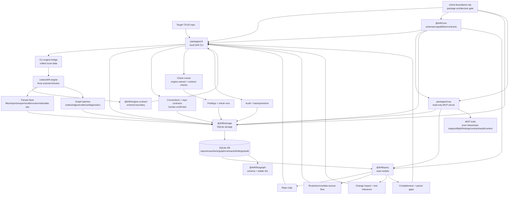
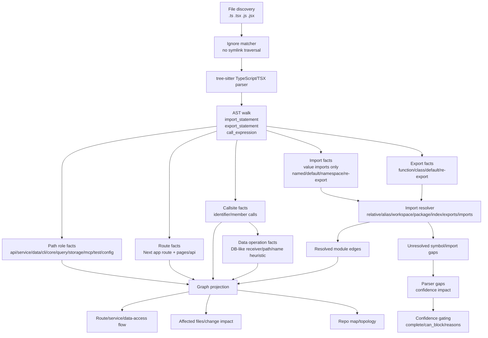
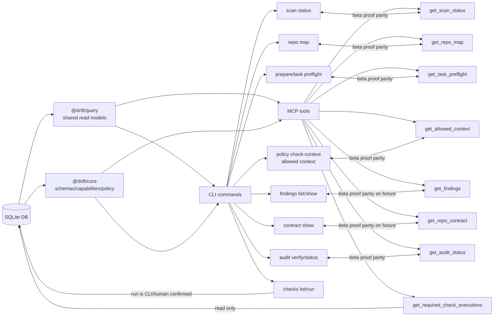
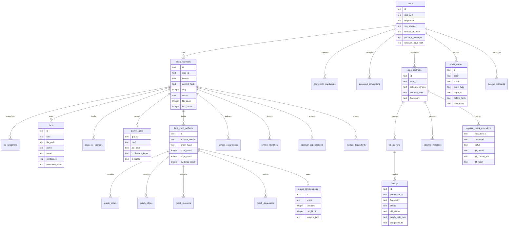

# Drift V3 Visual System Map

Date: 2026-05-24
Scope: diagrams reflect current code and live command behavior, not aspirational README text.

## 1. Full System Architecture

Key boundary facts:

- Rust commands are `scan-repo`, `check-repo`, and `infer-candidates`.
- MCP exposes read-only tools only.
- Raw SQLite is restricted to `@drift/storage`.
- CLI/MCP are transport surfaces; shared truth should live in core/query/storage.

## 2. Runtime Product Loop

```mermaid
flowchart LR
  Start["User runs scan/start"] --> Scan["Scan repo\nRust engine"]
  Scan --> Parse["Parse TS/JS facts"]
  Parse --> Graph["Build fact graph\nnodes/edges/evidence"]
  Graph --> Persist["Persist SQLite\nfacts + graph projections"]
  Persist --> Gaps["Persist parser gaps\nconfidence impact"]

  Persist --> Infer["Infer convention candidates"]
  Infer --> Review["Human reviews candidates"]
  Review -->|accept/import| Contract["Materialize repo contract"]
  Review -->|reject/no signal| NoContract["No contract\nmetadata only"]

  Contract --> Baseline["Baseline existing violations"]
  Contract --> Prepare["Prepare/agent preflight"]
  NoContract --> Prepare

  Prepare --> ContextPolicy["Apply context policy\nredactions/read-only"]
  ContextPolicy --> Agent["Agent gets repo map,\nrelevant files, checks, findings"]

  Agent --> Change["Human/agent changes code"]
  Change --> Check["drift check\nchanged hunks/files/full"]
  Check --> EngineCheck["Engine-backed checks\nno direct data access"]
  Check --> ContractChecks["Agent contract checks\nroles/imports/entrypoint/checks"]
  EngineCheck --> Findings["Findings\nblocking/advisory/waived"]
  ContractChecks --> Findings

  Findings --> RequiredChecks["Required check executions"]
  RequiredChecks --> Audit["Audit hash chain"]
  Findings --> Audit
  Contract --> Audit
  Baseline --> Audit

  Audit --> Backup["Backup/restore support"]
  Audit --> Proof["Beta/release proof artifacts"]
```

Reality check:

- Candidate inference alone does not create governance.
- Only accepted deterministic conventions can block.
- No-contract repos still support scan/status/repo-map/prepare, but contract-backed findings/checks refuse.
- Incremental reuse is not implemented; full scan says reuse was blocked.

## 3. TS Parsing Capability Flow

Production caveat:

- This is static syntax plus resolver and path heuristics. It is not full TypeScript semantic analysis.
- Live Drift-on-Drift scan found 45 parser gaps: 33 unresolved symbols and 12 unsupported framework patterns.

## 4. CLI/MCP Parity Map

Live parity notes:

- MCP tool list contains 11 read-only tools.
- Dogfood CLI and MCP both reported `drift.scan.status.v1`, 163 indexed files, and 45 parser gaps.
- Dogfood CLI and MCP both refused findings on no-contract state.
- Beta proof verified full fixture parity with `mcp_cli_parity_verified: true`.

## 5. Storage Schema Map

Schema evidence:

- Base local state starts in `packages/storage/src/migrations.ts:6`.
- Graph storage starts in `packages/storage/src/migrations.ts:244`.
- Graph v2 projections start in `packages/storage/src/migrations.ts:292`.
- Required check executions start in `packages/storage/src/migrations.ts:488`.
- Parser gaps start in `packages/storage/src/migrations.ts:540`.
- Symbol identities start in `packages/storage/src/migrations.ts:568`.
- Audit object hashes start in `packages/storage/src/migrations.ts:613`.
