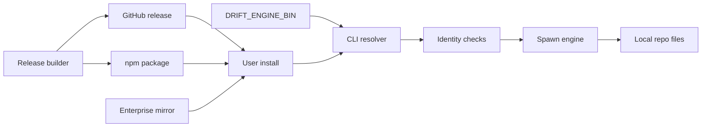

# Engine Binary Distribution Security

Date: 2026-05-22

## Purpose

Threat model the path that gets the Rust `drift-engine` executable onto a user's machine and then resolves it at runtime from the TypeScript CLI.

This is a supply-chain and local-execution boundary. If an attacker can replace the engine binary, Drift can run attacker code with the same filesystem access as the user invoking `drift`.

## Current State

Evidence anchors:

- `packages/cli/src/engine/rust-engine.ts` resolves the engine from `DRIFT_ENGINE_BIN` first, otherwise it searches upward for the Cargo workspace and runs `cargo run --quiet -p drift-engine --`.
- `packages/cli/src/engine/collect-scan-data.ts` defaults to Rust and only permits TypeScript fallback when `DRIFT_ALLOW_TYPESCRIPT_ENGINE_FALLBACK=1`.
- `packages/cli/package.json` publishes only `dist`; it does not yet package a Rust engine binary.
- `test/e2e/installed-flow.test.ts` proves installed-package flow by setting `DRIFT_ENGINE_BIN` to the locally built `target/debug/drift-engine`.
- `docs/architecture/engine-api-contract.md` requires default deterministic enforcement to fail closed when the engine is unavailable.
- `docs/architecture/release-compatibility-policy.md` treats engine schema, CLI JSON, packaging smoke tests, and installed-flow smoke tests as release gates.

So this document models the required packaged distribution path, not a completed implementation.

## Scope

In scope:

- npm package install path for the TypeScript CLI and Rust engine executable
- GitHub release artifact path if used for prebuilt binaries
- checksum and signature verification for downloaded or packaged binaries
- runtime executable resolution, including `DRIFT_ENGINE_BIN`
- `doctor` and `version` output needed to make binary provenance visible
- enterprise environments with offline installs, lockfiles, proxies, mirrors, and disabled lifecycle scripts

Out of scope:

- Rust parser memory-safety defects after a legitimate binary starts
- repo scanning path traversal, symlink, secret, and parser issues already covered in `docs/architecture/security-threat-model.md`
- third-party adapter sandboxing
- release account governance beyond the binary artifact signing requirements listed here

## Security Objectives

- The CLI must not execute an untrusted or silently substituted engine binary.
- A compromised network path must not be enough to replace the engine.
- A compromised GitHub release artifact must be detectable before execution.
- A compromised npm package must be detectable by provenance, lockfile integrity, and runtime metadata, though it cannot be fully prevented by client-side checks.
- Enterprise users must be able to install Drift without live internet access or lifecycle network scripts.
- Local overrides must be explicit, visible, and auditable.
- Failure must be noisy: no silent Rust-to-TypeScript downgrade, no silent checksum skip, no silent fallback to a different executable.

## Distribution Model

Preferred V1 model:

```text
@drift/cli
  -> depends on platform-specific Drift engine package or bundled checked-in package artifact
  -> resolves exact engine path from package metadata
  -> verifies expected identity before execution
  -> spawns the verified absolute path
```

Avoid this as the default V1 model:

```text
@drift/cli postinstall
  -> downloads binary from GitHub release
  -> writes executable into node_modules
  -> CLI trusts whatever was written
```

Postinstall download can be added later only if it is opt-in, checksum-pinned, signature-verified, proxy-aware, and has an offline cache path.

## Trust Boundaries



Primary boundaries:

- release builder to GitHub release artifact
- release builder to npm tarball
- npm registry or enterprise mirror to user's package manager
- optional postinstall downloader to GitHub or proxy
- environment variable to CLI resolver
- CLI resolver to OS executable spawn
- engine process to local repo and Drift state

## Assets

| Asset | Why it matters |
| --- | --- |
| Rust engine binary | Executes local code and reads arbitrary repositories. Integrity is critical. |
| npm package tarball | Controls CLI JavaScript, resolver behavior, and package metadata. |
| GitHub release artifact | If used as binary source, it becomes an executable supply-chain artifact. |
| checksum manifest | Detects accidental or malicious artifact substitution if the manifest is trusted. |
| signing key or certificate | Establishes artifact authenticity; compromise invalidates signature trust. |
| local Drift state | A substituted engine can corrupt scans, contracts, baselines, and audit metadata. |
| user's repository | A substituted engine can read source and secrets available to the current user. |
| `DRIFT_ENGINE_BIN` | Local trust bypass; useful for enterprise installs and development, dangerous if hidden. |

## Attacker Model

Realistic capabilities:

- Publish or induce install of a malicious lookalike package.
- Compromise the Drift npm package or one of its transitive dependencies.
- Replace a GitHub release artifact after checksums were generated incorrectly or out of band.
- Intercept a postinstall download through a proxy, TLS inspection appliance, cache poisoning, or misconfigured mirror.
- Set or influence `DRIFT_ENGINE_BIN` in shell profile, CI environment, editor task, or agent runner.
- Plant a malicious executable earlier in `PATH` if the resolver uses bare command names.
- Abuse archive extraction or platform package selection with path traversal names.

Non-capabilities assumed for V1 ranking:

- The attacker cannot compromise the user's OS trust store and every signing key at once.
- The attacker cannot bypass npm lockfile integrity when users install from a committed lockfile and trusted registry.
- The attacker cannot write to the user's filesystem before install except through package manager, postinstall, environment, or normal local user actions.

## Threats

| Threat | Abuse path | Likelihood | Impact | Priority | Required control |
| --- | --- | --- | --- | --- | --- |
| Binary substitution in package install | Attacker replaces `drift-engine` in package contents or local `node_modules`; CLI spawns it. | Medium | High | High | Resolve only absolute package-owned paths; verify checksum before first execution and after changes. |
| Compromised npm package | Attacker publishes malicious `@drift/cli` or platform engine package; package contains malicious JS or binary. | Medium | High | High | npm provenance, 2FA, lockfile integrity, minimal lifecycle scripts, package contents audit, installed-flow smoke from packed tarball. |
| Compromised GitHub release artifact | Release asset is replaced or uploaded maliciously; installer downloads it. | Medium if postinstall is used; Low otherwise | High | High when downloads exist | Signed checksums and artifact signatures; release digest embedded in npm package or generated in the same trusted release job. |
| Postinstall download replacement | Installer downloads a binary over network; proxy or mirror serves attacker content. | Medium | High | High | No default network postinstall in V1. If later enabled, require TLS, checksum pin, signature verification, and fail closed. |
| Checksum manifest substitution | Attacker replaces both binary and checksum file. | Medium | High | High | Do not trust remote checksum fetched from same mutable channel; embed expected digest in npm package or verify signed manifest. |
| Signature bypass | CLI accepts unsigned binaries, weak key IDs, expired certificates, or optional verification failures. | Medium | High | High | Verification state must be `verified`, `override`, or `failed`; failed verification blocks execution unless explicit unsafe dev flag is set. |
| Enterprise proxy breakage causes unsafe fallback | Corporate proxy blocks release download; installer falls back to source build, TS fallback, or arbitrary local binary. | Medium | Medium | Medium | Offline package path and explicit `DRIFT_ENGINE_BIN`; no automatic downgrade; doctor explains missing verified engine. |
| `DRIFT_ENGINE_BIN` hijack | Environment variable points to attacker binary; CLI treats it as normal engine. | Medium | High | High | Canonicalize, require file exists and executable, identify as override, hash it, expose it in `doctor`/`version`, optionally require confirmation outside dev. |
| PATH executable hijack | Resolver uses `drift-engine` or `cargo` by bare name in packaged mode; earlier PATH entry wins. | Medium | High | High | Packaged mode must use absolute package-owned binary path. `cargo run` path remains development-only. |
| Path traversal in archive extraction | Postinstall extracts archive with `../` or absolute paths and overwrites files. | Low if V1 avoids extraction; Medium if added | High | High when extraction exists | Avoid archive extraction in V1. Later extraction must reject absolute paths, `..`, symlinks, hardlinks, and non-regular files. |
| Wrong platform binary | Resolver picks incompatible or attacker-controlled package for platform/arch/libc. | Medium | Medium | Medium | Platform package metadata must match `process.platform`, `process.arch`, and libc where relevant; mismatch fails closed. |
| Engine version spoofing | Malicious binary prints expected protocol fields but different behavior. | Medium | High | High | Version output is diagnostic only; trust must come from package identity, checksum, and signature, not self-reported version. |

## Checksum Validation

Checksums are necessary but not sufficient.

V1 requirements:

- Compute SHA-256 of the exact executable file before spawning it.
- Compare against an expected digest shipped in trusted package metadata.
- Fail closed on mismatch.
- Include the digest and verification status in `doctor --json` and `version --json`.
- Treat checksum validation as integrity, not authorship.

Do not fetch the checksum from the same mutable URL as the binary and call that verification. That only detects accidental corruption, not substitution.

## Signature Validation Options

Acceptable options, from simplest to strongest:

1. npm package provenance plus package-manager lockfile integrity.
   This protects the package path but does not independently sign the binary inside the tarball.

2. Signed checksum manifest.
   The release job emits `checksums.txt` and signs it. The npm package embeds the expected digest or the verifier validates the signature with a pinned public key.

3. Sigstore keyless signing.
   The release job signs engine artifacts and the verifier checks certificate identity, issuer, repository, workflow, and transparency log inclusion.

4. Platform-native signing.
   macOS notarization/codesign and Windows Authenticode improve OS-level trust, but they should complement, not replace, Drift's own digest/provenance checks.

V1 can start with package-embedded SHA-256 plus npm provenance. Later hardening should add Sigstore or signed manifests before postinstall downloads are allowed by default.

## Postinstall Download Risks

Default V1 should not rely on postinstall network downloads.

Risks:

- package managers and enterprises often disable lifecycle scripts
- offline installs fail
- proxies and TLS inspection can alter the network path
- retry logic can hide partial downloads
- remote checksum files can be substituted with the binary
- extraction code introduces path traversal, symlink, hardlink, and permission risks
- installer bugs run during `npm install`, before the user intentionally executes Drift

If a postinstall downloader is added later:

- it must be optional, documented, and disabled by a deterministic environment flag
- it must support an offline cache path
- it must verify a signed manifest or embedded expected digest before writing the executable
- it must write to a temporary file, verify, chmod, then atomic rename
- it must never execute the downloaded file during install
- it must log enough diagnostic state for `drift doctor` without leaking proxy credentials

## Enterprise Offline And Proxy Environments

Enterprise-safe behavior:

- No required live GitHub access during install.
- No required postinstall script for the normal package path.
- Support package-manager mirrors and checked-in lockfiles.
- Support pre-seeded platform package tarballs.
- Support `DRIFT_ENGINE_BIN` for an enterprise-managed engine binary.
- Expose the override path, canonical path, hash, executable bit, and verification mode.
- Do not print proxy URLs with embedded credentials.
- Provide a clear failure when the engine is missing or unverifiable.

Expected enterprise modes:

| Mode | Requirement |
| --- | --- |
| npm mirror | CLI and engine packages install from mirrored tarballs with normal lockfile integrity. |
| air-gapped tarballs | Install from archived npm package tarballs; no network request required. |
| managed binary | `DRIFT_ENGINE_BIN` points to a centrally deployed binary; Drift reports it as an override. |
| source build | Development-only or enterprise build pipeline; packaged CLI should not silently invoke `cargo run` for production users. |

## Local Override: `DRIFT_ENGINE_BIN`

`DRIFT_ENGINE_BIN` is necessary for development, tests, source builds, and enterprise-managed deployments. It is also a direct executable trust bypass.

Required behavior:

- Resolve the value to an absolute canonical path.
- Reject missing files, directories, non-regular files, symlinks that escape a permitted policy when such policy is configured, and non-executable files.
- Never split the value into command plus arguments.
- Never search `PATH` for the override.
- Hash the resolved executable.
- Mark runtime source as `env_override`.
- In human output, say that an override is active.
- In JSON output, include enough machine-readable metadata to alert on unexpected overrides.

Recommended JSON shape:

```json
{
  "engine": {
    "source": "env_override",
    "path": "/absolute/path/to/drift-engine",
    "sha256": "<64 hex chars>",
    "version": "0.1.0",
    "verification": {
      "status": "override",
      "reason": "DRIFT_ENGINE_BIN is set",
      "expected_sha256": null
    }
  }
}
```

## Executable Resolution Risks

Packaged resolution rules:

- Prefer package-owned absolute binary paths over command names.
- Do not execute `cargo`, `node_modules/.bin/drift-engine`, or `drift-engine` from `PATH` in packaged mode.
- Do not construct executable paths from untrusted package names, platform strings, or user-controlled fragments without strict allowlists.
- The selected platform package must be an exact match for OS, CPU architecture, and libc family where relevant.
- The executable path must stay under the expected package directory after canonicalization.
- The resolver must not follow symlinks outside the expected package directory unless explicitly configured for an enterprise override.

Development resolution can keep workspace `cargo run`, but `doctor` and `version` must identify it as `source_build` or `workspace_cargo`, not a packaged verified engine.

## Doctor And Version Output

`drift doctor --json` and `drift version --json` should expose engine provenance, not only semantic versions.

Required fields:

- `engine.source`: `packaged`, `env_override`, `workspace_cargo`, `missing`, or `unverified`
- `engine.path`: canonical executable path when known
- `engine.version`: engine-reported version when the binary can be safely invoked, otherwise `null`
- `engine.expected_sha256`: expected digest when packaged
- `engine.sha256`: actual digest when the executable can be read
- `engine.checksum_matches`: boolean or `null`
- `engine.signature_status`: `not_applicable`, `verified`, `failed`, `unavailable`, or `override`
- `engine.package_name`: package that provided the binary, when packaged
- `engine.package_version`: package version that provided the binary, when packaged
- `engine.platform`: selected platform key
- `engine.override_active`: boolean
- `engine.executable`: boolean
- `engine.status`: `ok`, `warn`, or `fail`
- `engine.detail`: short human-readable reason

Human `doctor` output should include one line:

```text
Engine: packaged 0.1.0, verified sha256 <short>, /absolute/path
```

Override example:

```text
Engine: DRIFT_ENGINE_BIN override, unverified by package metadata, sha256 <short>, /absolute/path
```

Failure example:

```text
Engine: missing verified Rust engine; install the platform engine package or set DRIFT_ENGINE_BIN explicitly
```

## Detection And Logging

Drift should not phone home in V1, so detection is local and machine-readable.

Log or expose:

- engine source and canonical path
- checksum expected, actual, and match status
- signature status when implemented
- package name/version providing the engine
- override activation
- executable permission failures
- platform mismatch
- engine unavailable errors
- checksum/signature mismatch errors
- fallback activation when explicitly allowed

Do not log:

- proxy credentials
- full environment dumps
- shell profiles
- repo file contents as part of engine-resolution errors

## V1 Requirements

V1 must ship with these requirements before claiming packaged Rust engine support:

1. No default network postinstall download.
2. Packaged mode resolves a package-owned absolute engine path, not `PATH`.
3. Packaged engine has a SHA-256 digest stored in trusted package metadata.
4. CLI verifies the digest before spawning the packaged engine.
5. Digest mismatch fails closed.
6. Missing engine fails closed for deterministic enforcement.
7. `DRIFT_ENGINE_BIN` remains supported but is explicitly marked as an override.
8. `DRIFT_ENGINE_BIN` is canonicalized, existence-checked, regular-file checked, executable-bit checked, and hashed.
9. `doctor --json` and `version --json` expose engine source, path, version, expected digest, actual digest, verification status, package identity, override status, and failure details.
10. Human `doctor` output clearly distinguishes packaged verified, workspace Cargo, missing, and env override modes.
11. Installed-package smoke tests cover the packaged resolver without relying on workspace `cargo run`.
12. Tests cover missing binary, checksum mismatch, non-executable file, directory path, override path, and platform mismatch.
13. Release checklist includes package contents inspection for the engine executable and digest manifest.
14. TypeScript fallback remains explicit development compatibility only and never claims `engine_source: rust`.

## Later Hardening Requirements

After V1, add these before enabling broader binary distribution or network download paths:

1. Sigstore or signed-checksum verification for every release artifact.
2. npm provenance enforcement in release workflow and documented install verification.
3. Platform-native signing where useful: macOS codesign/notarization and Windows Authenticode.
4. Optional postinstall downloader only after signed manifest verification, offline cache support, proxy-safe diagnostics, and atomic write behavior exist.
5. Archive extraction hardening if compressed artifacts are used: reject absolute paths, `..`, symlinks, hardlinks, devices, FIFOs, and sockets.
6. Enterprise policy file for allowed engine hashes and allowed override directories.
7. `doctor` warning or failure policy when `DRIFT_ENGINE_BIN` points outside an allowed enterprise directory.
8. Transparency log or release attestation verification in CI.
9. Reproducible build or SLSA-style provenance for engine artifacts.
10. Security release process for revoking bad engine hashes and warning users through local metadata updates.
