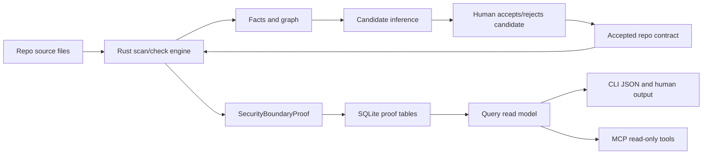

# Security Boundary P1-P8 Implemented Architecture

Current branch: `codex/security-phase8-production`.

This describes what is implemented in code now. It does not describe planned behavior.

## What This Adds

Drift can now check security boundaries for Next-style API routes using Rust-owned proof runs. TypeScript stores those proofs, validates their shape, and renders them through CLI, query, and MCP surfaces.

The rule is simple:

```text
Rust proof can block.
Accepted contracts decide what Rust should prove.
Candidate evidence can suggest, but cannot block.
TypeScript can display proof, but must not invent proof.
```

## Implemented Phase Map

| Phase | Implemented security question | Accepted contract kind | Main proof fields |
| --- | --- | --- | --- |
| P1 | Does the route have an accepted auth guard before protected sinks? | `api_route_requires_auth_helper` | `auth`, `missing_proof`, `parser_gaps` |
| P2 | Does middleware cover the route/method? | `middleware_must_cover_routes` | `middleware`, `missing_proof`, `parser_gaps` |
| P3 | Is request input validated before it reaches sinks? | `api_route_requires_request_validation` | `request_validation` |
| P4 | Are session, authorization, and tenant boundaries proven? | `session_object_must_come_from_trusted_helper`, `api_route_requires_authorization`, `api_route_requires_tenant_scope` | `session_trust`, `authorization`, `tenant` |
| P5 | Are sensitive responses and secret exposure blocked? | `api_route_forbids_sensitive_response_fields`, `api_route_forbids_secret_exposure` | `response_shape`, `sinks.secrets` |
| P6 | Are SSRF, raw SQL, CORS, CSRF, and rate-limit boundaries enforced? | `api_route_forbids_untrusted_ssrf`, `api_route_forbids_raw_sql_without_params`, `api_route_cors_must_match_policy`, `api_route_requires_csrf_for_mutation`, `api_route_requires_rate_limit` | `ssrf`, `raw_sql`, `cors`, `csrf`, `rate_limit` |
| P7 | Are new security conventions proposed safely? | Candidate rows, not accepted contracts | `convention_candidates`, `reason_not_blocking` |
| P8 | Can CLI and MCP explain proof-backed security state? | Read model over stored proof runs | `security_capabilities`, `routes[].security`, `drift.security.context.v2` |

## Data Flow



## Runtime Authority

Rust owns:

- Security fact extraction.
- Route/method/path binding.
- Guard dominance and sink reachability.
- Missing proof and parser gap decisions.
- Blocking findings for deterministic accepted contracts.
- Proof payloads for P1-P6.

TypeScript owns:

- Contract schema validation.
- SQLite persistence.
- Query read models.
- CLI and MCP formatting.
- Candidate election lifecycle.
- Release and beta proof checks.

TypeScript must not:

- Treat raw facts as deterministic security proof.
- Promote candidate evidence into blocking proof.
- Synthesize a passed proof when Rust did not emit one.

## Proof Shape

The shared proof object is `SecurityBoundaryProof` with:

- `proof_id`, `proof_version`
- `route`: route id, file path, role, endpoint path/method
- `contracts`: matched accepted contracts
- `capability_status`: complete/partial/unsupported/failed
- proof sections: `auth`, `middleware`, `request_validation`, `session_trust`, `authorization`, `tenant`, `response_shape`, `sinks`, `ssrf`, `raw_sql`, `cors`, `csrf`, `rate_limit`
- `missing_proof`: proof failures with fact ids
- `parser_gaps`: unsupported shapes that block deterministic proof
- `evidence_refs`: sanitized line-level references only
- `result`: `proven`, `missing_proof`, `parser_gap`, `violated`, or `advisory_only`

## Storage

The important security tables are:

| Table | Purpose |
| --- | --- |
| `security_boundary_proofs` | Scan-scoped proof snapshots kept for compatibility. |
| `security_boundary_proof_runs` | Check-run-scoped proof truth used by Phase 8 surfaces. |
| `scan_capability_reports` | Scanner/graph capability diagnostics. Not proof truth. |
| `convention_candidates` | Candidate conventions. Advisory until accepted. |
| `accepted_conventions` | Human-approved contracts that Rust can enforce. |
| `findings` | Stored check findings and lifecycle state. |

Migration `025_security_boundary_proof_runs` adds proof-run storage keyed by `(check_id, proof_id)` and indexed by repo/scan, repo/check, and repo/route.

## Main Read Models

| Surface | Source of security truth |
| --- | --- |
| `drift check --json` | Fresh Rust check result plus `security_boundary_proofs`. |
| Human `drift check` | Same proof payload, rendered as route/file/reason/evidence/capability/next command blocks. |
| `drift scan status --json` | Latest proof-run summaries plus diagnostic capability report. |
| `drift repo map --json` | Route map plus proof-backed `routes[].security`. |
| MCP `get_security_context` | `drift.security.context.v2` from the shared Phase 8 query read model. |
| MCP `get_repo_map` | Same route security model as CLI repo map. |

## Output Boundary

Phase 8 security outputs are designed to expose metadata, not source:

- Allowed: route id, route file path, method/path, line numbers, fact ids, capability names, missing proof codes, parser gap codes, finding ids.
- Not allowed: source snippets, secret values, raw request payloads, headers, raw SQL strings, raw URLs, environment values, tokens, user ids, tenant ids, full source.

## Current Important Files

| Area | Files |
| --- | --- |
| Rust check routing | `crates/drift-engine/src/check_command.rs` |
| Phase 6 Rust proof | `crates/drift-engine/src/security_phase6.rs` |
| Capability registry | `crates/drift-engine/src/security_capabilities.rs` |
| Shared schemas | `packages/core/src/security.ts`, `packages/engine-contract/src/index.ts` |
| Storage | `packages/storage/src/migrations.ts`, `packages/storage/src/sqlite-storage.ts` |
| Query read model | `packages/query/src/security-boundary-proof.ts` |
| CLI check/status/map | `packages/cli/src/check/run-check.ts`, `packages/cli/src/domain/scan-status.ts`, `packages/cli/src/domain/repo-map.ts`, `packages/cli/src/formatters/checks.ts` |
| MCP | `packages/mcp/src/security-context.ts`, `packages/mcp/src/index.ts` |
| Release proof | `scripts/run-beta-proof.mjs`, `scripts/generate-release-proof.mjs` |

## Current Risk Notes

- `security_boundary_proofs` remains for old scan-scoped rows. New Phase 8 truth should prefer `security_boundary_proof_runs`.
- Legacy MCP security context v1 still exists in code, but v2 is the proof-backed agent surface.
- Capability reports are useful diagnostics, but they are not proof that a route is safe.
- Candidate-sensitive fields are blocked from backing imported blocking sensitive-response contracts.
