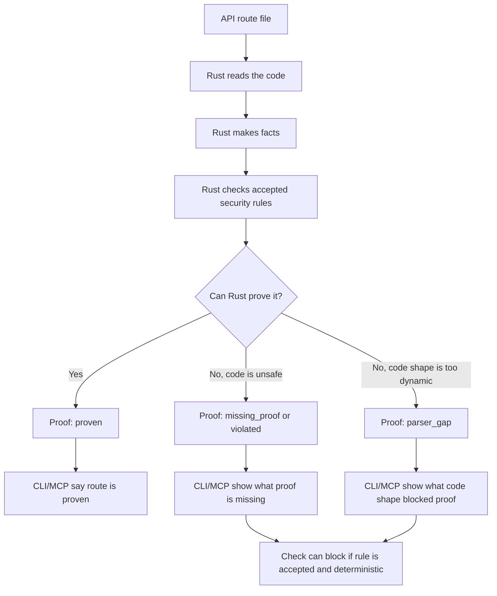

# Security Boundary P1-P8 Simple Visual

This is the simple version.

```text
You have an API route.

Drift asks:

1. Who can call it?
2. Did middleware really cover it?
3. Was request input checked before use?
4. Is tenant/user access proven?
5. Could sensitive data leak out?
6. Could it call unsafe URLs, SQL, CORS, CSRF, or rate-limit paths?

Rust answers with proof.
CLI and MCP show the proof.
Only accepted rules can block.
```

## Picture



## Tiny Legend

| Word | Plain meaning |
| --- | --- |
| Contract | A security rule a human accepted. |
| Candidate | A possible rule Drift noticed. It is not active yet. |
| Proof | Rust's route-level answer. |
| Missing proof | The rule applies, but Drift could not find the required safe guard. |
| Parser gap | The code is too dynamic for deterministic proof. |
| Capability | The type of thing Drift knows how to prove. |
| Read model | A clean summary made from stored proof. |

## What The User Sees

```text
drift check --json
  -> full proof payload

drift check
  -> simple BLOCK/WARN blocks

drift scan status --json
  -> what security capabilities are complete, partial, missing, unsupported

drift repo map --json
  -> each route gets a security summary

MCP get_security_context
  -> agent-safe proof summary, no source snippets
```

## What Is Not Happening

```text
Raw scan fact -> block
Candidate -> block
TypeScript guess -> block
MCP raw facts -> proof
```

Those paths are intentionally not trusted.

## The Whole Addition In One Sentence

Drift now turns accepted security rules into Rust-generated route proofs, stores those proofs, and gives humans and agents a safe explanation of which API routes are proven, missing proof, or blocked by parser gaps.
