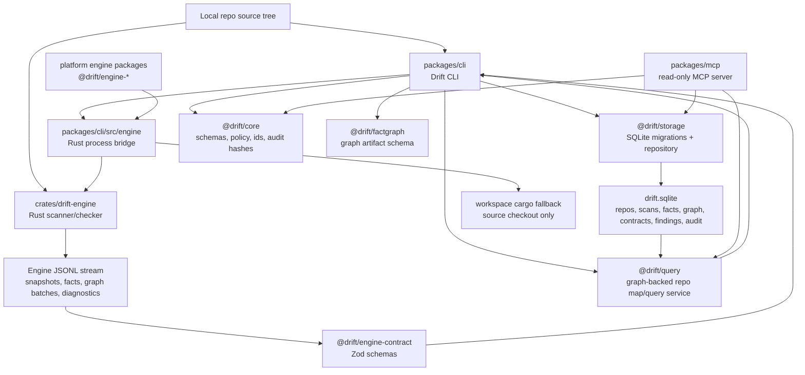

# Drift V3 Current-State Architecture Review

Date: 2026-05-22
Reviewer stance: senior architecture and engineering assessment from live repo state.

## Executive Summary

Drift V3 is no longer just a plan. The current workspace contains a real local-first repo intelligence product with a Rust engine, TypeScript CLI, SQLite persistence, graph projections, query layer, and read-only MCP surface. The coherent core is:

```text
scan -> infer/approve -> contract -> baseline -> prepare -> check -> audit/backup/restore
```

The main architectural direction is sound: Rust owns bounded repo scanning, TypeScript/JavaScript fact extraction, graph emission, import resolution, candidate inference, and engine-owned checks; TypeScript owns package boundaries, CLI workflow, schemas, storage, policy, local state, query composition, and MCP.

The current risk is not that the product is fake. The risk is that some important surfaces are now large enough to drift: MCP is a 2,038-line module, repo-map composition is duplicated between CLI and MCP, incremental scan state is recorded but reuse is explicitly disabled, and the full `pnpm verify:ci` gate currently fails because one long CLI test times out under suite load.

## Verification Snapshot

Commands run from `/Users/geoffreyfernald/Downloads/driftv3/drift v3`:

| Command | Result | Evidence |
| --- | --- | --- |
| `git status --short --branch` | Dirty branch | Branch `codex/drift-sprints-15-25`; many modified files under `drift v3/`, plus new docs/fixtures. These were pre-existing in this session. |
| `pnpm verify:ci` | Failed | Build, typecheck, Rust tests, package tests mostly passed; `packages/cli/test/cli.test.ts` timed out one test after 5s. |
| `pnpm --filter @drift/cli exec vitest run test/cli.test.ts -t "preserves human-governed finding statuses during repeated checks"` | Passed | 1 test passed, 299 skipped, test duration 3.601s. |
| `pnpm --filter @drift/cli exec vitest run test/cli.test.ts -t "does not count already-baselined findings as newly created"` | Passed | 1 test passed, 299 skipped, test duration 1.429s. |
| `node packages/cli/dist/main.js capabilities --json` | Passed | Reported local-first CLI, TypeScript API route layering wedge, SQLite, read-only MCP tools, no source mutation. |
| `node packages/cli/dist/main.js doctor --repo-root . --json` | Passed with warnings | Repo is recognized, but default state path under `~/.drift/.../drift.sqlite` is not initialized. |
| `node packages/cli/dist/main.js --db output/dogfood/.../drift.sqlite scan status --repo repo_8e87fba3c58ea49b --json` | Passed with stale scan | Latest scan exists, but current source has 15 modified files and `resolver_inputs_changed`. |
| `node packages/cli/dist/main.js --db output/dogfood/.../drift.sqlite repo map --repo repo_8e87fba3c58ea49b --limit 3 --json` | Passed | Returned graph-backed repo map, 144 indexed files, source snippets excluded. |
| MCP JSON-RPC `tools/list` and `get_runtime_info` through `node packages/mcp/dist/bin.js --db ...` | Passed | Returned 10 read-only MCP tools and runtime/governance metadata. |
| `sqlite3 output/dogfood/.../drift.sqlite ...` | Passed | Migrations 001-009 applied; persisted graph projections exist. |
| `node packages/cli/dist/main.js --db output/dogfood/.../drift.sqlite check --repo repo_8e87fba3c58ea49b --scope full --json` | Failed closed | Refused because no repo contract exists for the dogfood repo. |

Important caveat: `pnpm verify:ci` did not reach `test:e2e`, rustfmt, clippy, boundary checks, or `git diff --check` because `pnpm test` failed first.

## What Exists Now

### Workspace Shape

The active product lives under `drift v3/` inside the larger git checkout. It is a pnpm workspace plus a Rust Cargo workspace:

- Root package scripts are in `package.json`.
- Rust workspace is `Cargo.toml` with member `crates/drift-engine`.
- TypeScript packages include `@drift/core`, `@drift/storage`, `@drift/factgraph`, `@drift/query`, `@drift/engine-contract`, `@drift/cli`, `@drift/mcp`, `@drift/adapters`, and platform engine packages.
- Build artifacts exist in `packages/*/dist`.
- Local dogfood artifacts exist under `output/dogfood`.
- Rust build artifacts exist under `target`.

### Rust Boundary

Rust is the intelligence engine. It owns:

- File walking, ignore handling, hashing, and bounded scan behavior.
- TypeScript/JavaScript fact extraction.
- Streamed graph batches: file snapshots, facts, graph nodes, graph edges, graph evidence, diagnostics, and completion.
- Import resolution across aliases, workspace packages, index files, baseUrl/jsconfig, package imports, default exports, namespace diagnostics, and barrel re-exports.
- Candidate inference and deterministic check execution.
- Scale gates and conservative completeness behavior.

Key files:

- `crates/drift-engine/src/main.rs`
- `crates/drift-engine/src/facts.rs`
- `crates/drift-engine/src/check_command.rs`
- `crates/drift-engine/src/candidate_command.rs`
- `crates/drift-engine/src/protocol.rs`
- `crates/drift-engine/tests/stream_graph.rs`
- `crates/drift-engine/tests/graph_backed_check.rs`
- `crates/drift-engine/tests/scale_gates.rs`

### TypeScript Boundary

TypeScript owns product workflow and state:

- `@drift/core`: domain schemas, policy, versions, audit hash model, IDs.
- `@drift/storage`: SQLite migrations and persistence.
- `@drift/factgraph`: graph schema and artifact builders.
- `@drift/query`: graph-backed repo map and graph query primitives.
- `@drift/engine-contract`: Zod schemas for engine request/result/stream contracts.
- `@drift/cli`: command router, onboarding, scan/check/prepare/ask/repo-map/governance/backup/restore.
- `@drift/mcp`: read-only MCP wrapper over the same local state.

The current CLI entrypoint is clean: `packages/cli/src/main.ts` delegates to `runCli`, and `packages/cli/src/app/router.ts` routes command groups. That is a major improvement over a monolithic single CLI file.

### SQLite Storage Model

SQLite is the source of local governed state. Migrations 001-009 create:

- Repos, scans, file snapshots, facts, findings, baselines, audit events.
- Convention candidates, accepted conventions, repo contracts.
- Backup manifests.
- Audit hash-chain columns.
- Fact graph artifacts, graph nodes, graph edges.
- Graph v2 projections: evidence, diagnostics, completeness, symbol occurrences, resolver dependencies, module dependents.
- Scan file changes.
- Symbol occurrence kind.

The dogfood database currently has:

```text
repos|1
scan_manifests|1
facts|15907
graph_nodes|16128
graph_edges|23337
graph_evidence|11488
graph_diagnostics|0
convention_candidates|0
repo_contracts|0
audit_events|4
```

### CLI Surface

The CLI surface is broad and scriptable:

- Setup: `doctor`, `init`, `start`, `scan`, `scan status`.
- Intelligence: `repo map`, `prepare`, `ask`, `check`, `checks list`.
- Governance: `conventions`, `contract`, `findings`, `baseline`, `policy`.
- Audit and recovery: `audit`, `backup`, `restore`.
- Metadata: `version`, `capabilities`.

The CLI is JSON-first enough for agent automation, but still has human-readable output paths.

### MCP Surface

MCP is read-only by design. The tool list currently includes:

- `get_runtime_info`
- `get_capabilities`
- `get_audit_status`
- `get_scan_status`
- `get_repo_contract`
- `get_repo_map`
- `get_task_preflight`
- `get_conventions`
- `get_findings`
- `get_allowed_context`

The MCP runtime verified locally through JSON-RPC. It exposes no mutation tools.

### Graph and Import Resolution

Graph V2 is real. The fact graph schema supports repo/file/module/symbol/import/export/callsite/data operation/endpoint/route/file role/diagnostic/finding nodes and edges such as:

- `MODULE_IMPORTS_MODULE`
- `IMPORT_RESOLVES_TO_MODULE`
- `IMPORT_RESOLVES_TO_SYMBOL`
- `ROUTE_HANDLED_BY_SYMBOL`
- `DATA_OPERATION_WRITES_DATA_STORE`
- `FINDING_HAS_EVIDENCE`

The Rust tests prove current coverage for alias/workspace/index import resolution, extended tsconfig, jsconfig baseUrl, package imports, barrel re-exports, route-service-data access flow edges, default exports, namespace diagnostics, unresolved imports, and graph-backed checks.

## Architecture Diagram



## Product Loop Diagram

```mermaid
flowchart LR
    Scan["scan\nRust engine indexes repo"] --> Infer["infer\ncandidate conventions"]
    Infer --> Approve["approve\nhuman accepts/edits/rejects"]
    Approve --> Contract["contract\naccepted repo policy"]
    Contract --> Baseline["baseline\nlegacy findings marked pre-existing"]
    Baseline --> Prepare["prepare/ask/repo map\nagent preflight context"]
    Prepare --> Check["check\nchanged hunks/files/full"]
    Check --> Findings["findings\ngovernance statuses"]
    Findings --> Audit["audit\nappend-only hash chain"]
    Audit --> Backup["backup/restore\nstate recovery"]
    Backup --> Prepare
```



Current mismatch: the loop exists, but the dogfood state for this repo has no accepted contract and no candidates, so `check` fails closed with `No repo contract exists`. That is correct behavior for governance, but it means the checked-in dogfood state demonstrates scan/repo-map/MCP/storage more strongly than contract/check readiness.

## Critical Engineering Findings

### Blockers

1. Full CI gate fails on CLI test timeout.

Evidence:

- `package.json:18-20` defines `verify:ci` as the authoritative gate.
- `packages/cli/package.json:24-28` runs CLI tests with plain `vitest run`.
- `pnpm verify:ci` failed in `packages/cli/test/cli.test.ts`.
- First failure: `preserves human-governed finding statuses during repeated checks` timed out at `packages/cli/test/cli.test.ts:3716`.
- Re-run with a mistakenly broad filter passed that test later but timed out `does not count already-baselined findings as newly created` at `packages/cli/test/cli.test.ts:3974`.
- Proper isolated runs passed: 3.601s and 1.429s respectively.

Impact:

- Mainline confidence is blocked because the repo-level gate exits 1 before e2e, rustfmt, clippy, boundary checks, and `git diff --check`.
- The failing symptom is suite performance/flakiness against Vitest's 5s per-test default, not a proven business-logic failure in those isolated tests.

Smallest practical fix:

- Split the large CLI test file by workflow area or set explicit timeout only for the known Rust-engine-backed integration tests.
- Keep a fast unit layer for pure command parsing/storage behavior.
- Add a CI timing report so regressions show which command path got slower.

2. Current dogfood state has no accepted repo contract, so the check loop fails closed.

Evidence:

- `node packages/cli/dist/main.js --db output/dogfood/.../drift.sqlite check --repo repo_8e87fba3c58ea49b --scope full --json` returned `No repo contract exists for repo_8e87fba3c58ea49b.`
- SQLite state shows `convention_candidates|0` and `repo_contracts|0`.
- `output/dogfood/start.json` reports `candidates_count: 0` and `engine_source: "rust"`.

Impact:

- The scan, graph, repo-map, storage, audit, and MCP pieces are demonstrable.
- The full governed check loop is not demonstrable from the current dogfood DB without creating/importing a contract.

Smallest practical fix:

- Add a dogfood fixture or script that creates a minimal accepted contract for Drift-on-Drift, even if no candidates are inferred automatically.
- Keep the current fail-closed behavior for ad hoc checks without a contract.

### Non-Blockers

1. Dogfood scan is stale against current source.

Evidence:

- `scan status` reports latest scan `scan_b8d311289fd1298e`, branch `codex/drift-sprints-15-25`, dirty `true`.
- It reports `source_change_count: 15`, `stale: true`, and `invalidation_reasons: ["resolver_inputs_changed"]`.

Impact:

- Repo map and preflight output are usable as stale context, but they are not current enough for strict `require_fresh` flows.

Smallest practical fix:

- Re-run `drift scan --repo-root /Users/geoffreyfernald/Downloads/driftv3/drift v3 --json` into the same dogfood state after the current code slice settles.

2. Default `doctor --repo-root .` points to an uninitialized app-support state path, while dogfood state lives under `output/dogfood`.

Evidence:

- `doctor --repo-root . --json` reports database path `/Users/geoffreyfernald/.drift/repos/repo_8e87fba3c58ea49b/drift.sqlite`, `exists: false`, `repo_registered: false`, `contract_ready: false`.
- Verified dogfood state is at `output/dogfood/drift-state/repo_8e87fba3c58ea49b/drift.sqlite`.

Impact:

- A new user running doctor sees "not initialized" even though the repo contains dogfood evidence under `output/`.

Smallest practical fix:

- Document dogfood state separately from default local state.
- Consider a `--state-root output/dogfood/drift-state` example in dogfood docs.

### Design Debt

1. MCP is still a monolith and duplicates query assembly from CLI.

Evidence:

- `packages/mcp/src/index.ts` is 2,038 lines.
- MCP imports storage, query, policy, filesystem, git, JSON-RPC handling, pagination, validation, repo-map composition, preflight shaping, and formatting in one module.
- `packages/mcp/src/index.ts:1128-1228` builds repo-map payloads and merges graph/fact map files.
- `packages/cli/src/domain/repo-map.ts:51-165` does the same class of repo-map payload and graph/fact merge.

Impact:

- The read-only contract is solid, but duplicated payload logic can drift from CLI behavior.
- MCP changes are harder to review because transport, policy, query, and response shaping are in one large file.

Smallest practical fix:

- Move shared repo-map/preflight response builders into `@drift/query` or a dedicated shared package.
- Keep `packages/mcp` as transport, argument validation, and handler wiring.

2. Incremental scan state is persisted, but reuse is explicitly disabled.

Evidence:

- `packages/cli/src/domain/scan-status.ts:31-38` defines `IncrementalScanPlan` with `execution_mode: "full_scan"` and `reuse_applied: false`.
- `packages/cli/src/domain/scan-status.ts:341-370` always returns `execution_mode: "full_scan"`, `reuse_applied: false`, and includes `engine_reuse_not_enabled`.
- Migration `008_scan_file_changes` persists added/modified/deleted/unchanged file changes.

Impact:

- Drift can explain why it rescanned, but cannot yet use prior scan state to reduce work.
- This is acceptable for correctness now, but large-repo credibility still depends on real reuse or explicit bounded full-scan budgets.

Smallest practical fix:

- Implement reuse only after graph/index invalidation rules are reliable.
- Keep the current blocked reason until reuse exists.

3. TypeScript scanner fallback still exists behind an environment flag.

Evidence:

- `packages/cli/src/engine/collect-scan-data.ts:28-74` tries Rust first and only falls back to TypeScript when `DRIFT_ALLOW_TYPESCRIPT_ENGINE_FALLBACK=1`.
- Fallback emits no graph nodes, no graph edges, no graph evidence, and zero diagnostics.

Impact:

- This is not a runtime blocker because fallback is fail-closed by default.
- It remains a compatibility path with much weaker intelligence and must never be presented as equivalent to Rust engine output.

Smallest practical fix:

- Keep the fallback for tests/dev only.
- Add explicit diagnostic metadata whenever fallback output is used.

### Test Gaps

1. Full suite timing is underprotected.

Evidence:

- CLI has 300 tests in one file.
- Several engine-backed tests run near or above 3s, and one timed out at 5.481s in full suite.

Impact:

- CI can fail intermittently even when isolated behavior is correct.

Smallest practical fix:

- Split the file and/or annotate integration tests with realistic timeouts.

2. `verify:ci` did not complete later gates during this run.

Evidence:

- The run exited during `pnpm test`.
- Therefore `test:e2e`, `format:engine:check`, `lint:engine`, `check:boundaries`, and `git diff --check` were not verified in the full gate.

Impact:

- Current branch cannot be called merge-ready from this run.

Smallest practical fix:

- Fix the CLI test timing issue, then rerun `pnpm verify:ci` end to end.

### Product Gaps

1. Drift-on-Drift dogfood does not yet demonstrate the accepted-contract path.

Evidence:

- Dogfood scan has zero candidates and zero contracts.
- `check` fails closed.

Impact:

- The product can show repo map and read-only agent context, but not the main "accepted convention blocks drift" story on itself.

Smallest practical fix:

- Add a hand-authored Drift-on-Drift contract, or a fixture repo where candidate inference naturally produces the first accepted rule.

2. Supported wedge is still intentionally narrow.

Evidence:

- `capabilities --json` reports primary wedge `typescript_api_route_layering`.
- Supported convention kind is `api_route_no_direct_data_access`; service delegation is heuristic.
- Deferred items include desktop UI, cloud sync, Python adapter, duplicate helper detection.

Impact:

- Good for focus. Not yet a general code-intelligence platform.

Smallest practical fix:

- Finish the current TypeScript/Next.js graph/check wedge before adding new language adapters.

## What Is Solid

- The Rust/TypeScript boundary is coherent.
- The engine contract is explicit and schema-checked.
- SQLite schema has a real migration history and graph projections.
- Read-only MCP behavior is verified and has no mutation tools.
- Policy and governance are not hand-wavy: many mutating CLI actions require `--confirm`.
- Scan stale detection is real and catches resolver input drift.
- Audit hash-chain verification works in the dogfood state.
- Graph-backed repo map works and excludes source snippets.
- Import resolution coverage is much stronger than a simple import-string scanner.

## What Is Fragile

- Full CI is currently blocked by CLI integration test timing.
- MCP has too much responsibility in one file.
- CLI and MCP can drift where response builders are duplicated.
- Dogfood state is stale and contractless.
- Incremental scan is only status/reporting today, not reuse.
- The repo is heavily dirty; current assessment is of live uncommitted state, not a clean commit.

## Recommended Next Build Slices

1. Stabilize `pnpm verify:ci`.
   - Split `packages/cli/test/cli.test.ts` or raise targeted integration-test timeouts.
   - Rerun `pnpm verify:ci` until it reaches and passes every stage.

2. Make dogfood prove the whole loop.
   - Refresh dogfood scan.
   - Add or import a minimal accepted Drift-on-Drift contract.
   - Capture `prepare`, `repo map`, `check`, `audit verify`, `backup verify`, and MCP `get_scan_status` from the same fresh state.

3. Extract MCP shared response logic.
   - Move repo-map/preflight builders into shared query/domain code.
   - Leave JSON-RPC and argument validation in MCP.

4. Keep incremental scan honest.
   - Either implement reuse behind tested invalidation rules or keep reporting `engine_reuse_not_enabled`.
   - Do not imply incremental performance until reuse is real.

5. Preserve the narrow wedge.
   - Finish TypeScript/Next.js API route layering and graph-backed check quality before broadening languages or UI.

