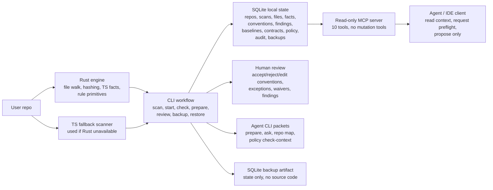
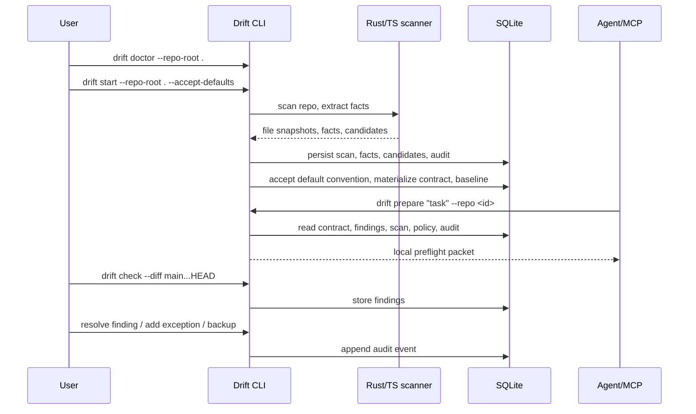

# Drift System Inventory And Product Readiness Map

Date: 2026-05-21
Scope: current `/Users/geoffreyfernald/Downloads/driftv3` worktree
Audience: senior engineering lead reviewing what has actually been built

## Executive Read

Drift is currently a **local-first, CLI-first repo intelligence guardrail** with a real end-to-end V1 loop:

`scan -> infer convention candidates -> accept/materialize contract -> baseline -> prepare/ask/repo map -> check -> findings -> audit -> backup/restore -> read-only MCP`

The product shell is ahead of the parser/graph core. That is not bad; it means Drift has been shaped into a product instead of just a parser experiment. The next shift should now be toward the code-intelligence engine: normalized parser facts, real graph nodes/edges, import resolution, fixture diversity, and consolidation of duplicated TypeScript/Rust rule logic.

Current maturity: **solid alpha / internal beta** for one wedge: TypeScript/JavaScript API route layering with deterministic direct-data-access checks. It is not yet a broad repo intelligence platform.

## What Exists

### Package Map

| Area | Path | Role | Current Status |
| --- | --- | --- | --- |
| Core model | `packages/core` | Domain records, schemas, IDs, capabilities, policy, audit helpers, canonical fingerprints | Built and tested |
| Storage | `packages/storage` | SQLite migrations and persistence API | Built and tested |
| CLI | `packages/cli` | Product workflow, onboarding, scan/check/review/governance/backup/restore | Built, broad, now large |
| MCP | `packages/mcp` | Read-only local agent API over MCP JSON-RPC | Built and installed-smoked |
| Rust engine | `crates/drift-engine` | TS/TSX fact extraction, ignore/hashing, direct-data-access rule, diff classification | Built, narrow |
| E2E tests | `test/e2e` | package packing, installed consumer smoke, release hygiene, binary smoke, golden lifecycle | Built and passing |
| Docs | `README.md`, `docs/*` | V1 scope, onboarding, product/technical plan | Strong root README; package READMEs thin |

### High-Level System Map

### Product Workflow

## Records And Local State

Drift stores product state in SQLite, not a folder full of JSON files. JSON is used as an interface format for CLI/MCP/contracts/tests.

Implemented tables:

| Table | Purpose |
| --- | --- |
| `schema_migrations` | applied SQLite migration IDs |
| `repos` | repo identity, root path, fingerprint |
| `scan_manifests` | scan status, commit/branch/dirty, versions, counts |
| `file_snapshots` | indexed file path, content hash, size |
| `facts` | extracted file/import/export/call/role facts |
| `convention_candidates` | inferred conventions awaiting review |
| `accepted_conventions` | human-governed machine-checkable conventions |
| `repo_contracts` | materialized contract JSON and schema version |
| `findings` | drift/check findings with status and evidence |
| `baseline_violations` | legacy violations that should not block new diffs |
| `audit_events` | append-only governance timeline with hash chain |
| `backup_manifests` | backup artifact path, checksum, size, schema |

Implemented migrations:

1. `001_initial_local_state`
2. `002_scan_facts`
3. `003_repo_contracts_and_conventions`
4. `004_backup_manifests`
5. `005_audit_integrity`

Core domain records include `ConventionCandidate`, `AcceptedConvention`, `RepoContract`, `FactRecord`, `ScanManifest`, `FileSnapshot`, `Finding`, `BaselineViolation`, `Policy`, `AgentPermission`, `AuditEvent`, `BackupManifest`, `RequiredCheck`, `SafeCommand`, and `RiskArea`.

## Current Command Surface

### CLI

Read/no-approval surfaces:

- `doctor`
- `version`
- `capabilities`
- `init`
- `scan`
- `scan status`
- `start`
- `ask`
- `prepare`
- `repo map`
- `checks list`
- `check`
- `conventions list`
- `conventions show`
- `findings list`
- `findings show`
- `audit list`
- `audit verify`
- `policy show`
- `policy check-context`
- `contract show`
- `contract validate`
- `contract waivers list`
- `backup list`
- `backup verify`
- `restore --dry-run`

Human-confirmed governance surfaces:

- `conventions accept --confirm`
- `conventions reject --confirm`
- `conventions edit --confirm`
- `conventions exception add --confirm`
- `findings mark-fixed --confirm`
- `findings mark-needs-review --confirm`
- `findings suppress --confirm`
- `findings accept-drift --confirm`
- `findings mark-false-positive --confirm`
- `baseline create --confirm`
- `baseline clear --confirm`
- `policy set-egress --confirm`
- `policy agent grant --confirm`
- `policy agent revoke --confirm`
- `contract export --confirm`
- `contract import --confirm`
- `contract waiver add --confirm`
- `contract waiver remove --confirm`
- `backup create --confirm`
- `restore --confirm`

Important wording correction: “read-only CLI” currently means **no source-code mutation and no governance confirmation required**. Some commands still mutate Drift local state, e.g. `scan`, `start`, and `check`.

### MCP

Implemented MCP tools are read-only:

- `get_runtime_info`
- `get_capabilities`
- `get_audit_status`
- `get_scan_status`
- `get_repo_contract`
- `get_repo_map`
- `get_task_preflight`
- `get_conventions`
- `get_findings`
- `get_allowed_context`

There are no MCP mutation tools. This is correct for V1.

## Parser, Rule, And Graph State

### What The Engine Can Read Today

Rust uses tree-sitter TypeScript/TSX and emits facts:

- `file_detected`
- `import_used`
- `exported_symbol`
- `symbol_called`
- `route_declared`
- `file_role_detected`
- `test_declared` exists in the domain model but is not meaningfully expanded yet

API route role detection is path-based:

- `app/**/route.ts|tsx|js|jsx`
- `pages/api/**`

The engine also implements:

- streaming SHA-256 file fingerprinting
- simple skip rules for `.git`, `node_modules`, `dist`, `build`, `coverage`, `.next`, `target`, `vendor`, `.env*`, and secret/binary-ish extensions
- direct data-access import detection
- stable finding fingerprints
- baseline classification
- unified diff parsing and `changed-hunks` / `changed-files` / `full` diff classification

### What Is Not A Graph Yet

Drift has a file-centric fact map, not a true graph.

Missing graph primitives:

- no `graph_nodes` / `graph_edges` tables
- no stable symbol IDs
- no resolved import graph
- no module/package dependency graph
- no route-to-service-to-db flow graph
- no call graph with receiver/context
- no cross-language graph model
- no graph query DSL beyond `repo map`, `prepare`, and MCP projections

The current facts are enough to power one deterministic wedge. They are not enough to reconstruct a codebase, explain full BE-to-FE flows, or detect duplicated utilities reliably.

## Product Vs Program Assessment

### As A Product

Strong:

- clear V1 wedge
- local-first posture
- CLI-first workflow
- human approval model
- installed-package smoke
- read-only MCP for agents
- governance audit trail
- backup/restore state story
- README onboarding and support matrix
- avoids overclaiming UI/cloud/Python/duplicate helper detection

Weak:

- `start --accept-defaults` is now framed as confirmation-equivalent in README and CLI help
- package READMEs are thin
- no real beta onboarding transcript or demo dataset
- no desktop UX yet
- no install/release/publish lane
- no telemetry or user feedback loop, by design local-first but still a product gap

Verdict: productized alpha / internal beta. It feels like a product loop, not just a tool, but it needs broader fixtures, release discipline, and parser/graph depth before a serious public beta.

### As A Program

Strong:

- tests are extensive for current wedge
- `pnpm verify:ci` is a strong gate
- CI runs the same verification gate
- package pack/install smoke is unusually good for this stage
- domain model is explicit and versioned
- state is centralized in SQLite
- Rust engine exists and is tested

Weak:

- CLI monolith risk has been reduced in the current worktree: `packages/cli/src/index.ts` is now a public shim and command logic lives under `packages/cli/src/{app,args,commands,domain,engine,check,formatters,io}`
- MCP still has a monolith risk and should be split after shared query/agent contracts land
- duplicated rule/diff authority exists between Rust and TypeScript
- fixture diversity is low
- bounded-memory claims are only partially true
- no performance/scale gate
- no release workflow/changelog/provenance
- storage operations are not transactional at the product-workflow level
- migration idempotence has a known risk around audit integrity columns

Verdict: implementation is credible. The CLI modularization is now substantially handled, so the next bottleneck is the engine/graph/storage substrate.

## Production Readiness Snapshot

Latest observed gate from audit:

- TypeScript typecheck: passing
- Build: passing
- Unit tests: `core 11`, `storage 8`, `mcp 31`, `cli 289`
- Rust engine tests: `17`
- E2E tests: `23`
- `git diff --check`: passing

Coverage strengths:

- compiled CLI binary
- package packing
- clean consumer install
- installed `drift`
- installed `drift-mcp`
- read-only MCP tools
- backup/restore dry-run/write
- audit verification
- capability/docs consistency

Coverage gaps:

- too much relies on `next-api-direct-db`
- no multi-repo fixture matrix
- no large repo performance fixture
- no symlink/cycle tests
- no `.gitignore` fidelity tests
- no parser fixture corpus beyond the first wedge
- no public release smoke

## Gap Map

| Gap | Severity | Why It Matters | Suggested Next Move |
| --- | --- | --- | --- |
| No true graph model | High | Core product promise is codebase intelligence, not just file facts | Define `FactGraph` schema and graph tables |
| Duplicated Rust/TS rule authority | High | Rule behavior can drift | Route check/rule execution through one engine contract |
| Boundary enforcement missing from CI | High | CLI split can regress as packages grow | Add boundary checker to `verify:ci` |
| MCP monolith and duplicated query logic | High | MCP can drift from CLI behavior | Move shared query/agent builders to a common package |
| Fixture diversity low | High | Current wedge can overfit | Add 3-5 realistic fixtures |
| Bounded-memory incomplete | High | Large repos can still blow memory | Add streaming engine output, batch persistence, max-file/max-fact limits, `.gitignore`, symlink policy |
| `start --accept-defaults` governance ambiguity | Addressed | Trust story can sound inconsistent | Documented as confirmation-equivalent in README and CLI help |
| Package READMEs thin | Medium | External package users lack local context | Expand CLI/MCP/storage package docs |
| No release lane | Medium | Hard to ship cleanly | Add changelog, version policy, publish dry-run |
| No dogfood transcript | Medium | Product value is not demonstrated on itself | Capture verified Drift-on-Drift walkthrough |
| No UI | Low for V1 | UI is not the next bottleneck | Defer until parser/graph and CLI loop are stable |

## Should We Shift To Parsers And Graphs Now?

Yes, but with a controlled sequence.

Do not jump to broad Python, UI, duplicate-helper detection, or cloud sync yet. The current product shell is strong enough to support the next engine push. The best move is to make the engine better while keeping the product loop stable.

Recommended next phase:

1. Add package/import boundary enforcement to `pnpm verify:ci`.
2. Define the engine API contract with generated validators.
3. Replace blob engine output with streaming/framed batches.
4. Move scan completion and graph writes into storage-owned transactions.
5. Define Rust `FactGraph` output:
   - files
   - file versions
   - packages
   - imports with local/imported/source/type
   - exports with symbol kind
   - calls with receiver/property/span
   - roles
   - evidence refs
6. Add SQLite graph tables and indexed projections.
7. Add shared agent response/refusal envelopes for CLI and MCP.
8. Route `drift check` through the engine contract instead of duplicated TypeScript logic.
9. Add fixtures:
   - clean API route
   - service-delegated route
   - monorepo alias imports
   - stale scan / branch change
   - no TypeScript repo
   - larger synthetic repo
7. Add performance and scale gates.

## Updated Roadmap Pointer

This inventory captured the first system audit. The more current frontier-grade sprint order now lives in:

- `docs/architecture/frontier-engineering-requirements.md`
- `docs/architecture/next-sprints-engine-roadmap.md`

The important update is that CLI modularization is no longer the main blocker in the current worktree. The next blockers are boundary enforcement, engine contract, streaming scan output, storage-owned durable workflows, agent response contracts, fixture determinism, and graph tables/query services.

## Bottom Line

Drift has successfully moved from concept into a product-shaped local agent guardrail. The strongest work so far is the governance/product shell: SQLite state, conventions, baselines, findings, audit, backup/restore, CLI onboarding, package smoke, and read-only MCP.

The main remaining question is not “do we need more product wrapper?” It is now “can the engine understand projects deeply enough to justify the product promise?”

The next serious investment should be parsers and graphs, but only after enforcing package boundaries, replacing blob scan output with streaming batches, and making storage own durable workflow invariants.
